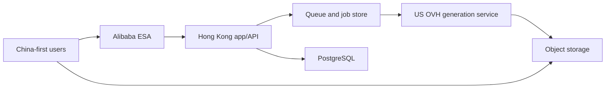

# Architecture

## Current state

The live application is an owner-reviewed controlled alpha: browser → GoodGood
Web/API → PostgreSQL + Valkey → one concurrent Worker → O1Key → private R2.
Authing supplies validated external identities; GoodGood owns account review,
sessions, authorization, creative data, and the credit ledger. The Hong Kong
single host and local-only preproduction topology follow ADR 0021; ADR 0024
narrows launch scope without claiming the full seed gate. Deployed identity
and verification are maintained in `docs/CURRENT_STATE.md`.

The following sections describe how these boundaries evolved. M3's mock and
RustFS path remains local test infrastructure, not the current live provider.
Deferred C6 deletion/content-safety code is isolated on the archive branch;
accepted ADRs for it do not mean its later migrations are deployed.

## Implementation evolution and contracts

The next selected authentication boundary is GoodGood-owned email OTP with a
managed mail-delivery provider, documented in [ADR 0045](decisions/0045-goodgood-owned-email-otp.md)
and [the rollout plan](EMAIL_AUTH_PLAN.md). GG-029 implements the P1 runtime,
P2 browser/operations surface, and P3 local release-preparation boundary in an
isolated candidate. Its read-only
operations report aggregates redacted authentication events and a cleanup
heartbeat, while an existing owner-review transition performs targeted session
revocation. The production preflight is mode-aware and verifies SMTP connection/
authentication without sending mail. A dry-run-first manifest tool adds a random
email identity only to an exact existing owner after matching its stored email,
prior non-email identity, reviewed manifest digest, and site-owner verification.
It does not mutate account, role, credit, asset, or project records. Per ADR 0016
these signals do not install a monitoring collector or notification transport.
The OIDC contracts below still apply to the deployed runtime until a separately
approved cutover.

M3 implements one production-shaped local generation path: the browser submits
an idempotent request, PostgreSQL transactionally creates a batch, job, audit
event, and queue outbox record, Valkey delivers it at least once, the worker
polls the HTTP mock provider, RustFS stores the image, PostgreSQL records the
asset, and the browser polls the job into the creation stream and asset library.
Worker leases and PostgreSQL reconciliation recover interrupted jobs, while
terminal writes and deterministic object keys tolerate duplicate delivery.
Outbox dispatchers atomically claim rows before publishing to Valkey, and
reconciliation only reopens a dispatched row after the Worker lease window.
The active Worker ignores a second delivery of an in-flight job, and any
unexpired lease blocks another claim even when the Worker identity matches.
After object upload, the Worker reports success only when the asset and job
terminal state commit together; a terminal loser removes its unaccepted object.
The creation client owns a stable run key per click so the temporary pending job
and later durable job remain one visible run. It keeps an unbounded registry of
overlapping active and failed runs; this is presentation state, never provider
identity or queue authority.

M4 replaces the fixed server-owned identity at the generation API boundary. A
provider-neutral `(issuer, subject)` identity maps to an internal GoodGood
owner before any generation read or write; cross-owner job, retry, and
generated-asset lookup returns no record. The production-shaped adapter uses
Authing discovery and OIDC Authorization Code with PKCE, state, nonce, and a
short-lived HttpOnly cookie binding the callback to its initiating browser.
Both successful and failed callback outcomes expire that one-time cookie. The
backend validates the signed, verified-email ID token, provisions the mapping
on first login, and exchanges it for an opaque, hashed, revocable GoodGood
session cookie. Discovery metadata is cached for at most five minutes; every
authorization request and code exchange fails closed unless the current
metadata still advertises Authorization Code, S256, required scopes, RS256,
and supported server-side client authentication. Provider tokens never become
browser API credentials. Compose
retains a local-only dual-account adapter and HttpOnly default local session as
test infrastructure. Loading that adapter additionally requires
`GOODGOOD_ALLOW_LOCAL_AUTH=true`; OIDC mode rejects the switch so a production
environment cannot silently inherit local test identities. An HTTPS OIDC
callback also makes `Secure` and the `__Host-` cookie prefix mandatory at
runtime, before login or discovery traffic can start.

Explicit logout first revokes the hashed GoodGood session and expires the
cookie, then returns a server-constructed Authing application logout URL for a
top-level browser navigation. Its callback is fixed to the GoodGood origin
derived from the configured login callback. This clears the hosted Authing
application session without retaining an ID Token or accepting a browser-owned
redirect target.

The email candidate replaces external identity proof with a browser-bound,
short-lived challenge. GoodGood stores only a keyed code digest, enforces
mailbox/IP/global limits in PostgreSQL, sends through one bounded SMTP adapter,
and atomically consumes the challenge while resolving or creating a random
`urn:goodgood:email` identity and opaque GoodGood session. New owners still
start pending. Delivery, identity, account review, authorization, and business
ownership remain separate; email mode does not accept provider tokens or fall
back to local fixtures. Existing-owner migration never infers ownership from an
email alone: the reviewed owner ID and current stored email must agree, and the
new binding records its manifest, operator, and reference hashes for exact replay.

ADR 0020 changes account admission without weakening OIDC identity validation.
Any verified Authing user may establish a GoodGood session, but a newly
provisioned owner starts pending. Session resolution and creation authorization
are separate: the pending session may read only its safe account/review state
and logout, while a shared server capability guard blocks references, drafts,
projects, assets, generation, retry, and credit consumption until approval.
System role, access state, and account tier are persisted independently. A
site-owner-only administration boundary performs account review and promotional
credit grants with server-derived actor identity, idempotency, append-only
ledger entries, and durable audit evidence; no browser action records payment
or directly rewrites a balance.
The implemented access projection uses `pending | active | suspended`; the
initial tier is `seed`, and one immutable `site_owner` assignment is created
only through the dry-run-first server bootstrap. The `/admin/users` browser
boundary can approve, suspend, restore, and grant at most 5000 test credits per
audited operation.

The reference boundary is now implemented locally. The authenticated
web API creates owner-scoped pending records and short-lived signed PUT URLs;
the browser transfers bytes directly to RustFS. Completion re-reads and fully
decodes the private object before marking it ready. A generation request
resolves only ready reference IDs owned by the caller, stores their order and
object keys in its immutable batch snapshot, and the worker resolves those
private objects through the selected provider route. The mock route creates
fresh signed GET URLs; the O1Key route reads the bytes server-side and creates
temporary provider attachments. Browser blob URLs and storage credentials never
enter the persisted generation contract.
An authenticated reference-list read exposes the same accepted rows as reusable
materials, newest first, and signs their private objects without returning raw
object keys. Composer reuse submits the existing stable reference ID, so the
upload path and provider attachment path remain unchanged.
The browser quick editor reads one ready material through the authenticated
`GET /api/references/:referenceId/content` boundary. The server rechecks owner,
ready/accepted state, and deletion state before returning private bytes with
`no-store`; this avoids depending on cross-origin object URLs for Canvas while
keeping storage keys and credentials out of the browser contract. Edited pixels
are uploaded as a new reference record, and a project edit synchronizes the new
ordered reference snapshot before the tray replacement is reported as saved.

M7 keeps this S3-compatible boundary but selects the private Cloudflare R2
`goodgood` bucket as staging's authoritative object store. Server requests and
browser presigned PUT/GET URLs both use the account R2 S3 API endpoint; the R2
public development URL and bucket custom domain remain disabled. The staging
credential has object read/write permission only for that bucket, so startup
verifies the bucket but cannot create it or rewrite CORS. The exact CORS policy
is an independently reviewed Cloudflare setting. The existing same-host RustFS
is a temporary non-authoritative fallback and receives no new staging objects.

ADR 0014 separates database recovery from that application-object boundary.
The root-run staging backup service creates a validated PostgreSQL custom
archive and sends it through Restic client-side encryption to the separate
private R2 `goodgood-postgres-backups` bucket. Application roles and the
application R2 credential cannot read that repository. One persistent daily
systemd timer applies the staging-only `14 daily / 8 weekly / 3 monthly`
policy, prunes, and verifies all encrypted repository data. A failure remains
visible in systemd status and the root journal without automatically retrying
or restoring. ADR 0016 delegates the production-monitoring platform and
notification route to a separate agent. The application-owned correlation
contract remains stable, while activation and live delivery enter the
vendor-neutral production gate as external evidence rather than an M7 staging
claim.
The same tool can decrypt the latest off-host archive into the root-only local
backup directory and pass it to the existing isolated restore drill. The
transient plaintext archive is always removed. ADR 0015 sets the paid-production
database objective to at most one hour RPO and four hours RTO, with at least
`14 daily / 8 weekly / 12 monthly` recovery points; the daily staging schedule
does not satisfy or prove that production objective.

The production Node web runtime creates one server-owned request/support ID per
HTTP request, returns it as `X-Request-Id`, and writes one structured completion
event with the normalized route, status, and elapsed time. It ignores inbound
request-ID values and excludes queries, cookies, credentials, prompts, email
addresses, signed URLs, object keys, and bodies. Successful authentication may
add the internal owner ID, while generation work may add job and provider task
IDs. Worker completion events also identify the provider route, end-to-end and
provider elapsed time, and the immutable customer-credit amount; upstream cost
continues to come from provider usage evidence rather than an invented value.

The M8 production preflight is a read-only Linux-host boundary. It compares one
clean source revision and its derived configuration checksum with an immutable
GHCR digest, the candidate's OCI labels, root-owned runtime/credential files,
and live Authing discovery. Its public report contains only checks, release
identity, and—only after every check passes—one revision-bound evidence item.
It does not own deployment, migration, health promotion, monitoring, recovery,
or checkout enablement; those remain separate evidence and orchestration
boundaries.

Artifact-security ingestion is a separate read-only trust boundary. Main CI
reruns the runtime-import smoke and High/Critical vulnerability scan against the
published digest, then uploads one uncompressed, immutable JSON artifact. The
importer compares the local file SHA-256 with GitHub's artifact digest and
requires the matching successful workflow run, revision, attempt, verify job,
publish job, and named security steps before it emits `artifact-security`
evidence. A downloaded or locally edited JSON file is not trusted by itself.
The production release planner consumes the same full readiness contract and
returns no plan while any evidence is missing, stale, or blocked. Even after a
pass it exposes only abstract ordered phases and has no command-execution path;
production mutation remains unavailable until the concrete traffic-switch and
runtime topology receive an accepted executable adapter.

Reference-byte cleanup is a separate one-shot maintenance boundary, not part
of a browser request or the continuously running worker. Its default dry-run
reports candidates without mutation. Explicit execution stages only incomplete,
rejected, or expired upload attempts behind a grace window, then claims a bounded
batch with expiring leases. Accepted ready uploads are durable user materials
even when no snapshot currently references them. Legacy `REFERENCE_ORPHANED`
rows whose objects still exist are restored to ready state. Generation
and project snapshot writes share a PostgreSQL lifecycle lock and revalidate
ready rows inside their write transaction; cleanup also checks immutable
generation snapshots, current project snapshots, and unexpired creation-draft
snapshots before staging and claiming.
It deletes the private object before recording terminal database evidence.
Failures retain the row and a stable retry code, and repeated execution is
idempotent. Automatic scheduling remains disabled until staging policy and
capacity evidence exist.

M4 now also persists owner-scoped projects. Project create/update validates
that every submitted job and ready reference belongs to the authenticated
owner, then associates batches transactionally. Project reads restore the
latest prompt, ordered ready references, stable model parameters, and every
batch newest-first with fresh private-object signatures. A generation submitted
from a restored project verifies ownership before reference resolution and
updates the project snapshot in the same transaction as its new batch/job.
The shared browser workspace mounts real `/projects` and
`/projects/:projectId` entries over that API. Native history updates the stable
URL without duplicating workspace state, and a direct detail load waits for the
GoodGood session before performing the owner-scoped restore.

The authenticated root creation surface now has a deliberately smaller durable
draft boundary. `GET/PUT/DELETE /api/draft` reads, replaces, or clears exactly
one unprojected draft for the resolved owner. It stores only prompt, ordered
ready references, and stable generation settings, expires 30 days after its
last write, and uses a monotonic optimistic version. The browser serializes its
own writes and stops autosaving on a stale-version conflict until the user
explicitly keeps the current tab or restores the newer server draft. Project
detail state never hydrates from or writes to this root draft; saving the root
context as a project or confirming a clean creation clears it.

The authenticated asset library now reloads successful accepted outputs from
PostgreSQL through `GET /api/assets`. The repository constrains jobs, batches,
and assets to the same resolved owner, sorts by submission time newest-first,
and the presentation boundary signs every private object URL on each read.
Image download resolves a new signed read through the owner-scoped stable Asset
ID at click time; it never reuses the expiring preview URL retained in browser
state. The API returns only the short-lived URL, and the browser still transfers
the large image bytes directly from private object storage.
Loading, empty, and retryable failure states replace stale in-memory assumptions
after reload; representative mock batches remain available only in no-auth
preview mode. Signed private-object images render directly from browser to
object storage. The shared primitive covers restored draft/project reference
thumbnails as well as generated assets and project covers. These images do not
pass through the application image optimizer, which avoids proxying user bytes,
preserves the expiring signature, and keeps private-IP SSRF protection enabled
for all server-side fetches.

The durable generation capability admits `nano-banana-2` across 14 ratios and
the three GPT image product IDs `gpt-image-2.5-sunburst`, `gpt-image-2`, and
`gpt-image-2.5-flare` across seven exact-size ratios. Nano uses one output; GPT accepts
`1 / 2 / 4` outputs in one native task. Both accept up to 10 validated
references and `1K` / `2K` / `4K`. The browser and O1Key adapter use model-owned
capability allowlists; unknown combinations fail before provider submission.
Primary real Authing/Google/email loopback exchange passes; provider edge-case
and secure public-callback verification remain external evidence work;
billing is active for every newly created generation job. M6 persists immutable
server-owned prices, exact account caches, append-only credit entries, and
composable reserve/settle/release/refund transactions. Banana 2 costs 10 credits
for its single output. Each enabled GPT image model costs 10 credits per image, with immutable
10/20/40-credit rows for counts 1/2/4 at every resolution; new and migrated owners receive one 100-credit
welcome grant. The authenticated `GET /api/billing` boundary exposes only exact
available/reserved balances and active product quotes as decimal strings; it
does not expose internal account, owner, ledger, or provider-channel IDs. No
payment UI or real payment provider is configured yet. A local-only fake
payment provider now exercises immutable CNY 10 / 500-credit product versions,
owner-scoped idempotent orders, signed webhook replay protection, and an atomic
paid-order credit grant. An operator-only, dry-run-first command can record an
already received and invoiced business payment as a `manual` provider order and
append the paid-credit grant through the same transaction; no browser admin
endpoint exists. Domestic Alipay is selected for the later customer checkout,
after the production domain is ICP-filed and the merchant product is approved.
The O1Key worker path now has one real
credentialed URL-output loopback smoke plus the accepted at-most-once
submission guard from ADR 0008. New API usage records are the interim source
for upstream charge/refund evidence. Project and asset navigation share one client workspace.
Project index/detail, asset index/detail, and root creation are URL-addressable.
`/create` is the canonical creation URL while `/` remains a compatibility entry
to the same state; future Explore, Moodboards, and Help routes remain deferred.

## GG-030 enterprise boundary (implemented locally; not deployed)

GG-030 introduces `Workspace` as the authorization and durable ownership scope.
Every existing user receives one personal Workspace; organization Workspaces
have explicit memberships and roles. The authenticated session continues to
resolve one stable internal user. A workspace selector supplied by the browser
is accepted only after the server validates the current membership, user access
state, organization state, and requested capability.

The target feature boundary is:

```text
verified GoodGood user
  -> workspace authorization (personal owner or active organization member)
  -> creation/project/reference/asset repository scoped by workspace
  -> personal credit, or organization credit + member budget reservation
  -> durable creator and workspace audit evidence
```

Organization membership is not an Authing group, GG-029 challenge, email-domain
rule, or GG-027 direct-child relationship. GG-030 consumes the existing
provider-neutral session and normalized verified email. Invitation acceptance
matches that email transactionally; a later notification adapter may send the
invite but cannot reuse authentication codes or secrets.

Enterprise billing uses one Workspace credit account plus an earmarked member
budget. Generation locks and validates both scopes before reserve, then settles
or releases them together. A Workspace mismatch among project, batch, job,
Asset, credit entry, or budget entry fails closed. Existing personal ledger rows
retain their user and receive the corresponding personal Workspace during an
additive backfill.

The organization credit repository is deliberately separate from the personal
billing repository. It atomically updates the organization account and member
budget and appends immutable evidence for grant, allocation/reclaim, reserve,
settlement, and release. The generation boundary now resolves Workspace access,
stores Workspace and creator IDs, and calls these operations in the same
transaction; no provider request can be queued before both enterprise limits
reserve successfully.

Managers read generated company Assets through a role-authorized query and
fresh signed URLs. They do not impersonate the creator and cannot use the same
query to sign personal or raw reusable-reference objects. Platform site-owner
operations remain under `/admin/users`; enterprise administration has a
separate repository, API, and route boundary.

The browser sends an explicit Workspace header through draft, reference,
project, generation, and Asset boundaries. Personal requests remain compatible
without that header; organization requests fail closed until the current
session's active membership is resolved. `/workspaces/:workspaceId/create`
mounts the shared creation tool only after this validation. Enterprise overview,
member, usage, and Asset routes use their own HTTP boundary, require CSRF on
writes and audited downloads, and never treat a hidden navigation item as
authorization.

## Target production topology



The Hong Kong application is the control plane. The existing US OVH server is
the generation plane. Large image bytes should use signed direct object-storage
transfer whenever possible; do not proxy completed images through the app
server.

ADR 0017 selects the provider-neutral initial production runtime adapter without
choosing an infrastructure SKU or changing the documented Hong Kong
control-plane direction: Alibaba Cloud ESA targets one Linux Nginx origin with
two loopback-only Compose application slots.
Only one slot receives Web traffic and only one Worker consumes the production
queue. The inactive Web candidate is checked before a bounded Worker handoff and
an atomic Nginx upstream replacement. PostgreSQL, Valkey, and private R2 remain
outside both slots. Rollback restores the prior Web upstream and Worker but
never downgrades schema. The checked-in planner describes this adapter and has
no execution path.

ADR 0021 selects the already purchased Alibaba Cloud Hong Kong Simple
Application Server as the initial unpaid seed-production control plane. Its
2-vCPU / 4-GiB / 50-GiB boundary temporarily holds Nginx, Web, Worker,
PostgreSQL, and Valkey. Private Cloudflare R2 remains authoritative for image
bytes. This is a deliberate single application/state failure domain, not a
high-availability claim. ADR 0018's separate ECS, RDS PostgreSQL HA, and Tair
profile remains a future scale-out direction rather than a seed-launch gate.

There is no persistent remote staging environment in this phase. The operator
workstation owns mock and production-shaped local testing with test-only data
and credentials; CI produces the immutable candidate. The production host
performs a bounded inactive-Web candidate check, single-Worker handoff, public
synthetic verification, and rollback rehearsal. Local success never substitutes
for production callback, storage, resource-headroom, recovery, or release
evidence. `staging-goodgood.o1key.com` remains reserved and inactive.

The M7 test environment becomes production infrastructure only after a clean
conversion. No staging owner, session, credit, project, job, audit row, queue
item, or object enters production. Fresh PostgreSQL and Valkey state, an
inventory-cleared private `goodgood` R2 bucket with rotated credentials,
rotated production secrets, and an audited site-owner bootstrap define the new
boundary. `goodgood.o1key.com`
remains the canonical application hostname. Domestic Alipay and the applicable
ICP/domain review remain a later paid-commercialization gate. ADR 0021 grants
no data deletion, live configuration change, or deployment authority.

The current Authing application and identity directory are reused, but its OIDC
client secret rotates at conversion. GoodGood has no shared session-signing
secret: fresh PostgreSQL state omits every old hashed session token. Only the
exact `goodgood.o1key.com` production callback/logout URLs remain allowed;
local real-Authing tests may not use the production application. Authing
identity records are not GoodGood accounts: after the clean database reset,
any returning identity provisions a new pending owner with no inherited role,
credit, session, or content before the normal site-owner review boundary.

## Initial runtime units

Keep one modular codebase and one versioned application image initially. Run it
as two independently restartable processes:

- `web`: UI delivery, authenticated API, authorization, job submission,
  projects, assets, pricing, and account-facing status;
- `worker`: queue consumption, provider routing, polling/callback
  reconciliation, result ingestion, and terminal settlement.

PostgreSQL is authoritative for domain and ledger state. Redis-compatible
coordination may deliver work more than once, so consumers are idempotent and
jobs remain recoverable from PostgreSQL. Object storage owns reference and
generated image bytes. Neither process stores durable state in memory or its
container filesystem.

## Request boundaries

1. Browser authenticates with GoodGood.
2. Browser requests signed reference uploads from the GoodGood backend.
3. Browser uploads reference bytes directly to object storage.
4. Backend validates prompt, model capability, references, quota, and request ID.
5. Backend creates a durable generation job and enqueues work.
6. Worker calls the selected server-side generation gateway with a server-only
   credential.
7. Worker stores outputs in object storage and writes asset/batch records.
8. Browser may idempotently save the owner-scoped creative context as a project;
   later project reads re-sign private references and outputs.
9. Browser reloads its owner-scoped accepted assets with fresh signed reads.
10. Browser reads its owner-scoped credit summary and active product quote; it
    never sends a price or balance mutation. It may separately read a paginated
    business-level activity projection that collapses reservation lifecycle
    rows and exposes no internal ledger key.
11. An authorized payment client may create an order using only a stable product
    ID and idempotency key. A verified provider callback, or the trusted
    dry-run-first operator command for an independently confirmed receipt, may
    mark it paid and grant only the snapshotted credit.
12. A site-owner browser may review accounts and append promotional credit only
    through the administrator boundary. The backend derives the actor from the
    GoodGood session, checks the persisted role before target lookup, and writes
    idempotent review/ledger/audit evidence without a payment order.
13. Under ADR 0043, a site owner may separately assign an enterprise/distributor
    business role and one active direct parent. An eligible active parent may
    request a server-authorized transfer to an active direct child. The backend
    rechecks role, relationship, and payment-funded available credit, locks both
    accounts in deterministic order, and commits paired ledger entries plus one
    immutable transfer/audit record atomically. The browser never supplies a
    balance, provenance, price, or money amount.
14. Browser receives status through polling initially; SSE/WebSocket is optional
    only when measurement justifies it.

## Non-negotiable security boundaries

- No model provider key in client JavaScript.
- No identity-provider client secret, access token, ID token, refresh token, or
  raw GoodGood session token in client-readable storage or persisted logs.
- Login attempts are one-time and short-lived; OIDC issuer, audience,
  signature, nonce, and verified email are checked before provisioning.
- No public object-storage write credential.
- Every asset read/write is authorized against the owning user/project.
- Every project read/write and batch association is owner-scoped.
- Upload MIME, decoded type, size, dimensions, and count are validated server-side.
- Job creation is idempotent. The initial observation phase has no hidden
  per-user, queue-depth, or concurrent-job count limit; later abuse controls
  require a separate product decision.
- Callback signatures are verified when a selected provider supports callbacks;
  polling and all provider payloads remain untrusted.
- Administrative navigation is not authorization. Every account-list, review,
  role, tier, and promotional-credit operation requires the persisted site-
  owner role and append-only audit evidence.
- Business role is not system-administrator authority. Every credit transfer
  requires the persisted allocation capability, active direct relationship,
  active accounts, and sufficient payment-funded available credit. Transfer
  ownership and provenance are derived server-side.

## Capacity posture

The initial Hong Kong seed-production node is the existing 2-vCPU / 4-GiB
control-plane host; builds happen in CI and image bytes bypass it. This is not a
promise that one node can handle production persistence indefinitely. One
active Worker process starts accepted jobs concurrently without a fixed count
ceiling, while PostgreSQL claims, persisted provider-submission guards, and
ledger transactions remain authoritative per job. SIGINT/SIGTERM stops new
queue intake and drains in-flight work before shared resources close.

Only new generation submit/retry requests pass through host admission. They
pause below 500 MiB `MemAvailable`, at 80% root-disk use, or when those host
observations fail. Protection remains latched until operator review and Web
restart; safe reads and administration stay outside that boundary.

Upgrade priorities:

1. Separate build from runtime and impose container memory limits.
2. Move images to object storage and add CDN/ESA delivery.
3. Add durable PostgreSQL backups and Redis/job recovery.
4. Scale app workers horizontally before adding in-process state.
5. Separate managed database when availability or migration risk justifies it.

## Provider abstraction

UI model IDs are stable product identifiers. Map them server-side to provider
model/version and capability data. A provider adapter exposes create, status,
cancel where supported, normalize-error, and result-ingestion behavior.

Never branch UI behavior on raw provider error strings.

The US service is a generation gateway, not an extension of the browser or a
GoodGood administrator. It receives a dedicated least-privilege service
credential. Automatic grouping may route between explicitly equivalent
provider routes for the selected GoodGood model, but it must not silently
change model families. Persist route version and each provider attempt so
retries, reconciliation, cost, and support remain auditable.

M5/GG-010 map the stable `nano-banana-2` product route to O1Key's special-price
`gemini-3.1-flash-image-c-sp` route for `1 / 2 / 4` outputs across all 14 product-defined
aspect ratios and `1K` / `2K` / `4K`. The selected ratio and resolution remain
in the durable job snapshot and are sent unchanged as O1Key `aspect_ratio` and
`size`. Because Banana exposes no native count field, a count-N GoodGood batch
submits N single-image tasks without an `n` field. The backend-only adapter uses
Bearer authentication, uploads each validated private reference once per
submission/resume invocation to
`POST /v1/o1key/uploads` in stable order, submits `fileData` references to
`POST /async/v1/generateImage`, and polls
`GET /async/v1/tasks/{task_id}`. The temporary upload URL is publicly readable
for 24 hours and is only an intermediate provider-transfer artifact; GoodGood's
private object remains authoritative (RustFS locally and R2 in M7 staging).
Completed outputs must be downloaded promptly and stored in GoodGood-owned
object storage.

GG-033 maps the stable GPT product IDs `gpt-image-2.5-sunburst`, `gpt-image-2`,
and `gpt-image-2.5-flare` to the same exact O1Key provider IDs. Their seven
ratios map to 21 explicit lowercase-`x` pixel sizes across the same product
resolution values. The adapter sends that exact pixel string as `size` with
`n: 1`, `2`, or `4`; it does not send Nano-specific `aspect_ratio` or
`response_modalities`. Product records retain the stable model, ratio,
resolution, count, quality, background, and output format while each attempt
retains a distinct immutable route identity for each provider model. The adapter
always sends top-level `quality`, `background`, and `output_format`, including
the explicit defaults `auto`, `auto`, and `png`. Transparent output is admitted
only with PNG or WebP; this is checked before the billable provider POST.

Worker routing is explicit and persisted per attempt. Nano's current
`o1key-gemini-3.1-flash-image-c-sp-v4` route sends `response_modalities` as
`["TEXT", "IMAGE"]`. New Nano requests always send top-level
`thinking_level: "high"`; disabled search is omitted and enabled search sends
`google_search: true`. Historical records explicitly frozen as low thinking
still omit the provider field on retry. The route stores a versioned ordered task-set
token in `provider_task_id`; each returned task ID is persisted, followed by a
submission-started marker immediately before the next POST. A restart completes
only a provably unstarted suffix and then polls
all known tasks concurrently in ordinal order. The default Compose path
selects a model-specific M3 mock route; the O1Key override selects the matching
Nano or GPT route, reads the
ordered private reference bytes, and resumes persisted provider task evidence after a
worker restart. Downloaded JPEG, PNG, or WebP results are bounded, type-checked,
fully decoded, and stored with content-derived object extensions and stable
positive ordinals before one terminal job transaction accepts the complete
Asset set. A worker whose selected route
does not match an active attempt defers that job instead of polling the wrong
provider.

The documented O1Key image API exposes neither an upstream idempotency key nor
an image callback/signature contract. O1Key confirmed that duplicate POSTs
create distinct charged tasks and that a lost submission response cannot be
recovered through a client identifier or `X-Oneapi-Request-Id`. The adapter
therefore does not invent either field. GoodGood's browser/API submission
remains idempotent. For O1Key, the active attempt is durably moved from
`created` to `submitted` immediately before the billable POST; if the worker is
later reclaimed without a durable `task_id`, it fails as `SUBMISSION_UNKNOWN`
instead of submitting again. For a Banana multi-task batch, the worker also
compare-and-swaps the ordered task-set token after every accepted response and
before every following POST. A safe partial token resumes; a persisted
submission-started marker or ambiguous next POST remains
`SUBMISSION_UNKNOWN` and is never repeated automatically. An explicit user
retry is a new billable request.
Polling is the only accepted MVP status transport. Identical terminal polls are
duplicates, conflicting confirmed terminal polls fail closed, and a new worker
can resume after the provider task ID is durable. One observed `FAILURE` is held
as a provisional candidate and must repeat before the job becomes terminal; a
later non-failure observation clears it. After `SUCCESS`, the returned asset URL
has a bounded delivery-retry window before decode failure is normalized. These
poll/download retries never repeat the paid generation POST. Successful/failed
provider result data must be ingested within its default 24-hour retention
window.

## Account and billing boundary

GoodGood owns user identity, authorization, product entitlements, versioned
prices, and credit accounting independently of the US generation service. The
backend is the only authority that may reserve, settle, release, refund, grant,
or expire credit. Payment-provider callbacks and generation completion events
are signed and idempotent; the frontend only displays state and initiates
authorized actions.

M6 operates behind this boundary. `PriceVersion` selection is server-side and
deterministic; batches retain the selected version, unit, and amount. Each
credit mutation locks the owner/unit account, appends an immutable signed entry,
and updates cached available/reserved balances in the same PostgreSQL
transaction. Identity provisioning grants 100 credits once. Generation creation
reserves 10 credits; an accepted Asset settles it, while a terminal no-Asset
failure releases it. That release includes `SUBMISSION_UNKNOWN` as a customer
policy without claiming an upstream refund. A reservation can close exactly
once through settle or release; one settled single-output generation can
receive one full refund.

Migration 0010 adds an immutable version-1 `credits-500-cny` product whose exact
money snapshot is CNY 1000 minor units and whose grant is 500 credits. Payment
orders snapshot both sides, are unique by owner/idempotency key, and may move
only from `pending` to `paid`. The fake provider uses the public order ID as its
sandbox order reference. Its HMAC callback is timestamp-bounded; accepted event
IDs and exact payload hashes are append-only. The order transition, one payment
ledger grant, and event evidence commit in one PostgreSQL transaction. Repeated
identical events return the recorded result, conflicting event-ID reuse fails,
and later success events for an already-paid order are recorded without another
grant. The temporary manual path resolves an active owner by exact
case-insensitive email, stores a globally unique external receipt as the
`manual` provider order ID, and uses the same immutable order snapshot and
settlement helper. It accepts only a stable product ID, operator identity, and
receipt reference; neither money nor credit amounts are operator inputs. Exact
replay is a no-op, and receipt reuse across an owner or product fails closed.
Customer checkout UI and the domestic Alipay adapter remain absent pending ICP
filing and provider evidence.

ADR 0020's site-owner test-credit path is not a payment adapter. It appends a
positive promotional `grant` and linked administrative audit record in one
transaction, using a server-derived actor and idempotency key. Pending owners
may receive the existing welcome grant and later promotional grants, but the
shared admission guard prevents reservation or consumption until approval.

ADR 0043 adds a distribution boundary behind the same product-owned ledger. A
payment-authored grant creates payment-funded credit; welcome, promotional, and
ordinary adjustment entries create non-transferable credit. The account cache
keeps source-aware available/reserved projections, while immutable source
amounts on ledger entries preserve the payment-funded portion of reservations
and downstream transfers. Generation reserves non-transferable credit first, records the source
split, and settles, releases, or refunds that exact split.

A transfer service owns business-role and direct-relationship authorization. It
locks both credit accounts in stable ID order, rejects self/cyclic/non-direct
movement, debits only the parent's payment-funded available projection, credits
the child's matching projection, and appends `transfer_out`/`transfer_in`
entries joined by one public transfer record in the same transaction. Holding
eligible credit never grants this capability by itself. GoodGood exposes no
downstream price, fiat amount, payment, order, commission, revenue, or withdrawal
contract; the existing operator-only manual-payment command remains the only
pre-checkout paid-credit path.

The local stage-3 service serializes transfer requests by parent-scoped
idempotency identity, shares the hierarchy mutation lock with site-owner role
and relationship changes, locks both credit accounts in owner-ID order, and
rechecks active parent role, active direct relationship, account access, and
payment-funded available credit before appending either ledger side. Transfer
history is caller-scoped and keyset paginated; direct-child summaries expose
only identity and allocation totals, not the child's private balance.

The local stage-4 browser boundary mounts `/distribution` inside the existing
workspace so creation state survives navigation. Session projection carries the
current business role only to decide whether to show the entry; every summary,
child-list, history, and transfer request authenticates and reauthorizes on the
server. The site-owner dashboard reads active eligible parents independently of
the current account filter, so relationship choices do not disappear when the
operator filters the table. The page refreshes server-owned balance and child
state after a transfer success or conflict and never submits a derived balance.

The read side is deliberately narrower than the ledger. `GET /api/billing`
authenticates before resolving the owner, performs no mutation, returns
`Cache-Control: no-store`, and serializes exact aggregate and payment-funded
transferable available credit as decimal strings. It never exposes the source
split of an individual ledger entry. The browser refreshes it after queue
acceptance and terminal job states. Local frontend preview mode may return the
same public response shape from fixed data; the production-shaped Node runtime
always reads PostgreSQL.
`GET /api/billing/activities` uses the same authenticated owner and `no-store`
boundary. It scans owner-keyed immutable entries newest-first, joins only the
same owner's generation context, and maps reserve plus settle/release to one
public activity. A separate owner-scoped aggregate counts only settled debits
for the Shanghai calendar day, Monday-based week, and month; open reservations
and released amounts are excluded. Items expose a stable activity category and
the same job/batch reference already visible in the asset library. Cursor and
item references use derived public activity tokens; raw ledger/account/payment/
provider identifiers, generation configuration, prompts, and reasons stay
server-only.
Transfer ledger rows appear in the same activity projection as `其他变动` with
their public `trf_` reference. They may participate in received/outgoing list
filters, but they are deliberately excluded from today/week/month generation
consumption totals because allocation is not product usage.
