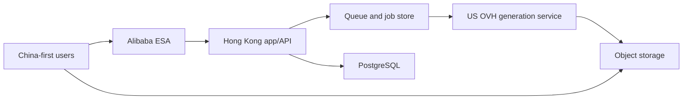

# Architecture

## Current state

M3 implements one production-shaped local generation path: the browser submits
an idempotent request, PostgreSQL transactionally creates a batch, job, audit
event, and queue outbox record, Valkey delivers it at least once, the worker
polls the HTTP mock provider, RustFS stores the image, PostgreSQL records the
asset, and the browser polls the job into the creation stream and asset library.
Worker leases and PostgreSQL reconciliation recover interrupted jobs, while
terminal writes and deterministic object keys tolerate duplicate delivery.

M4 replaces the fixed server-owned identity at the generation API boundary. A
provider-neutral `(issuer, subject)` identity maps to an internal GoodGood
owner before any generation read or write; cross-owner job, retry, and
generated-asset lookup returns no record. The production-shaped adapter uses
Authing discovery and OIDC Authorization Code with PKCE, state, nonce, and a
short-lived HttpOnly cookie binding the callback to its initiating browser.
Both successful and failed callback outcomes expire that one-time cookie. The
backend validates the signed, verified-email ID token, provisions the mapping
on first login, and exchanges it for an opaque, hashed, revocable GoodGood
session cookie. Discovery metadata is cached for at most five minutes; every
authorization request and code exchange fails closed unless the current
metadata still advertises Authorization Code, S256, required scopes, RS256,
and supported server-side client authentication. Provider tokens never become
browser API credentials. Compose
retains a local-only dual-account adapter and HttpOnly default local session as
test infrastructure. Loading that adapter additionally requires
`GOODGOOD_ALLOW_LOCAL_AUTH=true`; OIDC mode rejects the switch so a production
environment cannot silently inherit local test identities. An HTTPS OIDC
callback also makes `Secure` and the `__Host-` cookie prefix mandatory at
runtime, before login or discovery traffic can start.

Explicit logout first revokes the hashed GoodGood session and expires the
cookie, then returns a server-constructed Authing application logout URL for a
top-level browser navigation. Its callback is fixed to the GoodGood origin
derived from the configured login callback. This clears the hosted Authing
application session without retaining an ID Token or accepting a browser-owned
redirect target.

The reference boundary is now implemented locally. The authenticated
web API creates owner-scoped pending records and short-lived signed PUT URLs;
the browser transfers bytes directly to RustFS. Completion re-reads and fully
decodes the private object before marking it ready. A generation request
resolves only ready reference IDs owned by the caller, stores their order and
object keys in its immutable batch snapshot, and the worker resolves those
private objects through the selected provider route. The mock route creates
fresh signed GET URLs; the O1Key route reads the bytes server-side and creates
temporary provider attachments. Browser blob URLs and storage credentials never
enter the persisted generation contract.

M7 keeps this S3-compatible boundary but selects the private Cloudflare R2
`goodgood` bucket as staging's authoritative object store. Server requests and
browser presigned PUT/GET URLs both use the account R2 S3 API endpoint; the R2
public development URL and bucket custom domain remain disabled. The staging
credential has object read/write permission only for that bucket, so startup
verifies the bucket but cannot create it or rewrite CORS. The exact CORS policy
is an independently reviewed Cloudflare setting. The existing same-host RustFS
is a temporary non-authoritative fallback and receives no new staging objects.

Reference-byte cleanup is a separate one-shot maintenance boundary, not part
of a browser request or the continuously running worker. Its default dry-run
reports candidates without mutation. Explicit execution first stages expired
pending, rejected, expired, or sufficiently old unreferenced ready rows behind
a grace window, then claims a bounded batch with expiring leases. Generation
and project snapshot writes share a PostgreSQL lifecycle lock and revalidate
ready rows inside their write transaction; cleanup also checks immutable
generation snapshots, current project snapshots, and unexpired creation-draft
snapshots before staging and claiming.
It deletes the private object before recording terminal database evidence.
Failures retain the row and a stable retry code, and repeated execution is
idempotent. Automatic scheduling remains disabled until staging policy and
capacity evidence exist.

M4 now also persists owner-scoped projects. Project create/update validates
that every submitted job and ready reference belongs to the authenticated
owner, then associates batches transactionally. Project reads restore the
latest prompt, ordered ready references, stable model parameters, and every
batch newest-first with fresh private-object signatures. A generation submitted
from a restored project verifies ownership before reference resolution and
updates the project snapshot in the same transaction as its new batch/job.
The shared browser workspace mounts real `/projects` and
`/projects/:projectId` entries over that API. Native history updates the stable
URL without duplicating workspace state, and a direct detail load waits for the
GoodGood session before performing the owner-scoped restore.

The authenticated root creation surface now has a deliberately smaller durable
draft boundary. `GET/PUT/DELETE /api/draft` reads, replaces, or clears exactly
one unprojected draft for the resolved owner. It stores only prompt, ordered
ready references, and stable generation settings, expires 30 days after its
last write, and uses a monotonic optimistic version. The browser serializes its
own writes and stops autosaving on a stale-version conflict until the user
explicitly keeps the current tab or restores the newer server draft. Project
detail state never hydrates from or writes to this root draft; saving the root
context as a project or confirming a clean creation clears it.

The authenticated asset library now reloads successful accepted outputs from
PostgreSQL through `GET /api/assets`. The repository constrains jobs, batches,
and assets to the same resolved owner, sorts by submission time newest-first,
and the presentation boundary signs every private object URL on each read.
Loading, empty, and retryable failure states replace stale in-memory assumptions
after reload; representative mock batches remain available only in no-auth
preview mode. Signed private-object images render directly from browser to
object storage. The shared primitive covers restored draft/project reference
thumbnails as well as generated assets and project covers. These images do not
pass through the application image optimizer, which avoids proxying user bytes,
preserves the expiring signature, and keeps private-IP SSRF protection enabled
for all server-side fetches.

The durable generation capability remains intentionally limited to
`nano-banana-2`, 1:1, 1K, one output, and up to 10 validated references.
Primary real Authing/Google/email loopback exchange passes; provider edge-case
and secure public-callback verification remain external evidence work;
billing is active for every newly created generation job. M6 persists immutable
server-owned prices, exact account caches, append-only credit entries, and
composable reserve/settle/release/refund transactions. Banana 2 is 10 credits
for one output at 1K, 2K, or 4K; new and migrated owners receive one 100-credit
welcome grant. The authenticated `GET /api/billing` boundary exposes only exact
available/reserved balances and active product quotes as decimal strings; it
does not expose internal account, owner, ledger, or provider-channel IDs. No
payment UI or real payment provider is configured yet. A local-only fake
payment provider now exercises immutable CNY 10 / 500-credit product versions,
owner-scoped idempotent orders, signed webhook replay protection, and an atomic
paid-order credit grant. An operator-only, dry-run-first command can record an
already received and invoiced business payment as a `manual` provider order and
append the paid-credit grant through the same transaction; no browser admin
endpoint exists. Domestic Alipay is selected for the later customer checkout,
after the production domain is ICP-filed and the merchant product is approved.
The O1Key worker path now has one real
credentialed URL-output loopback smoke plus the accepted at-most-once
submission guard from ADR 0008. New API usage records are the interim source
for upstream charge/refund evidence. Project and asset navigation share one client workspace.
Project index/detail, asset index/detail, and root creation are URL-addressable.
`/create` is the canonical creation URL while `/` remains a compatibility entry
to the same state; future Explore, Moodboards, and Help routes remain deferred.

## Target production topology

The Hong Kong application is the control plane. The existing US OVH server is
the generation plane. Large image bytes should use signed direct object-storage
transfer whenever possible; do not proxy completed images through the app
server.

## Initial runtime units

Keep one modular codebase and one versioned application image initially. Run it
as two independently restartable processes:

- `web`: UI delivery, authenticated API, authorization, job submission,
  projects, assets, pricing, and account-facing status;
- `worker`: queue consumption, provider routing, polling/callback
  reconciliation, result ingestion, and terminal settlement.

PostgreSQL is authoritative for domain and ledger state. Redis-compatible
coordination may deliver work more than once, so consumers are idempotent and
jobs remain recoverable from PostgreSQL. Object storage owns reference and
generated image bytes. Neither process stores durable state in memory or its
container filesystem.

## Request boundaries

1. Browser authenticates with GoodGood.
2. Browser requests signed reference uploads from the GoodGood backend.
3. Browser uploads reference bytes directly to object storage.
4. Backend validates prompt, model capability, references, quota, and request ID.
5. Backend creates a durable generation job and enqueues work.
6. Worker calls the selected server-side generation gateway with a server-only
   credential.
7. Worker stores outputs in object storage and writes asset/batch records.
8. Browser may idempotently save the owner-scoped creative context as a project;
   later project reads re-sign private references and outputs.
9. Browser reloads its owner-scoped accepted assets with fresh signed reads.
10. Browser reads its owner-scoped credit summary and active product quote; it
    never sends a price or balance mutation.
11. An authorized payment client may create an order using only a stable product
    ID and idempotency key. A verified provider callback, or the trusted
    dry-run-first operator command for an independently confirmed receipt, may
    mark it paid and grant only the snapshotted credit.
12. Browser receives status through polling initially; SSE/WebSocket is optional
   only when measurement justifies it.

## Non-negotiable security boundaries

- No model provider key in client JavaScript.
- No identity-provider client secret, access token, ID token, refresh token, or
  raw GoodGood session token in client-readable storage or persisted logs.
- Login attempts are one-time and short-lived; OIDC issuer, audience,
  signature, nonce, and verified email are checked before provisioning.
- No public object-storage write credential.
- Every asset read/write is authorized against the owning user/project.
- Every project read/write and batch association is owner-scoped.
- Upload MIME, decoded type, size, dimensions, and count are validated server-side.
- Job creation is idempotent and rate-limited.
- Callback signatures are verified when a selected provider supports callbacks;
  polling and all provider payloads remain untrusted.

## Capacity posture

The early Hong Kong node may begin as a 2 vCPU / 4 GB control-plane instance if
builds happen in CI and image bytes bypass it. This is not a promise that one
node can handle production persistence indefinitely. The known 50–80 async
generation concurrency primarily belongs to the OVH generation plane.

Upgrade priorities:

1. Separate build from runtime and impose container memory limits.
2. Move images to object storage and add CDN/ESA delivery.
3. Add durable PostgreSQL backups and Redis/job recovery.
4. Scale app workers horizontally before adding in-process state.
5. Separate managed database when availability or migration risk justifies it.

## Provider abstraction

UI model IDs are stable product identifiers. Map them server-side to provider
model/version and capability data. A provider adapter exposes create, status,
cancel where supported, normalize-error, and result-ingestion behavior.

Never branch UI behavior on raw provider error strings.

The US service is a generation gateway, not an extension of the browser or a
GoodGood administrator. It receives a dedicated least-privilege service
credential. Automatic grouping may route between explicitly equivalent
provider routes for the selected GoodGood model, but it must not silently
change model families. Persist route version and each provider attempt so
retries, reconciliation, cost, and support remain auditable.

M5 maps the stable `nano-banana-2` product route to O1Key's special-price
`gemini-3.1-flash-image-c-sp` route at 1:1, 1K, and one output. The backend-only
adapter uses Bearer authentication, uploads each validated private reference to
`POST /v1/o1key/uploads` in stable order, submits `fileData` references to
`POST /async/v1/generateImage`, and polls
`GET /async/v1/tasks/{task_id}`. The temporary upload URL is publicly readable
for 24 hours and is only an intermediate provider-transfer artifact; GoodGood's
private object remains authoritative (RustFS locally and R2 in M7 staging).
Completed outputs must be downloaded promptly and stored in GoodGood-owned
object storage.

Worker routing is explicit and persisted per attempt. The default Compose path
selects the M3 mock route; the O1Key override selects the route above, reads the
ordered private reference bytes, and resumes the persisted `task_id` after a
worker restart. Downloaded JPEG, PNG, or WebP results are bounded, type-checked,
fully decoded, and stored with a content-derived object extension before the
existing terminal job transaction accepts them. A worker whose selected route
does not match an active attempt defers that job instead of polling the wrong
provider.

The documented O1Key image API exposes neither an upstream idempotency key nor
an image callback/signature contract. O1Key confirmed that duplicate POSTs
create distinct charged tasks and that a lost submission response cannot be
recovered through a client identifier or `X-Oneapi-Request-Id`. The adapter
therefore does not invent either field. GoodGood's browser/API submission
remains idempotent. For O1Key, the active attempt is durably moved from
`created` to `submitted` immediately before the billable POST; if the worker is
later reclaimed without a durable `task_id`, it fails as `SUBMISSION_UNKNOWN`
instead of submitting again. An explicit user retry is a new billable request.
Polling is the only accepted MVP status transport. Identical terminal polls are
duplicates, conflicting confirmed terminal polls fail closed, and a new worker
can resume after the provider task ID is durable. One observed `FAILURE` is held
as a provisional candidate and must repeat before the job becomes terminal; a
later non-failure observation clears it. After `SUCCESS`, the returned asset URL
has a bounded delivery-retry window before decode failure is normalized. These
poll/download retries never repeat the paid generation POST. Successful/failed
provider result data must be ingested within its default 24-hour retention
window.

## Account and billing boundary

GoodGood owns user identity, authorization, product entitlements, versioned
prices, and credit accounting independently of the US generation service. The
backend is the only authority that may reserve, settle, release, refund, grant,
or expire credit. Payment-provider callbacks and generation completion events
are signed and idempotent; the frontend only displays state and initiates
authorized actions.

M6 operates behind this boundary. `PriceVersion` selection is server-side and
deterministic; batches retain the selected version, unit, and amount. Each
credit mutation locks the owner/unit account, appends an immutable signed entry,
and updates cached available/reserved balances in the same PostgreSQL
transaction. Identity provisioning grants 100 credits once. Generation creation
reserves 10 credits; an accepted Asset settles it, while a terminal no-Asset
failure releases it. That release includes `SUBMISSION_UNKNOWN` as a customer
policy without claiming an upstream refund. A reservation can close exactly
once through settle or release; one settled single-output generation can
receive one full refund.

Migration 0010 adds an immutable version-1 `credits-500-cny` product whose exact
money snapshot is CNY 1000 minor units and whose grant is 500 credits. Payment
orders snapshot both sides, are unique by owner/idempotency key, and may move
only from `pending` to `paid`. The fake provider uses the public order ID as its
sandbox order reference. Its HMAC callback is timestamp-bounded; accepted event
IDs and exact payload hashes are append-only. The order transition, one payment
ledger grant, and event evidence commit in one PostgreSQL transaction. Repeated
identical events return the recorded result, conflicting event-ID reuse fails,
and later success events for an already-paid order are recorded without another
grant. The temporary manual path resolves an active owner by exact
case-insensitive email, stores a globally unique external receipt as the
`manual` provider order ID, and uses the same immutable order snapshot and
settlement helper. It accepts only a stable product ID, operator identity, and
receipt reference; neither money nor credit amounts are operator inputs. Exact
replay is a no-op, and receipt reuse across an owner or product fails closed.
Customer checkout UI and the domestic Alipay adapter remain absent pending ICP
filing and provider evidence.

The read side is deliberately narrower than the ledger. `GET /api/billing`
authenticates before resolving the owner, performs no mutation, returns
`Cache-Control: no-store`, and serializes exact integer credit as decimal
strings. The browser refreshes it after queue acceptance and terminal job
states. Local frontend preview mode may return the same public response shape
from fixed data; the production-shaped Node runtime always reads PostgreSQL.
