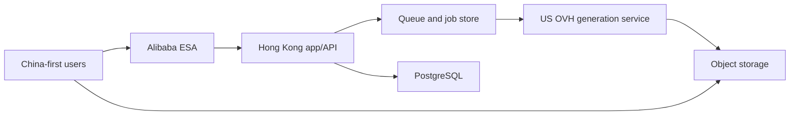

# Architecture

## Current state

The repository is an interactive prototype. All generation, projects, assets,
and saves live in React memory and use `/public/nano-fashion.png` as simulated
output. The empty Drizzle schema is intentional. Do not confuse UI simulation
with production integration.

## Target production topology

The Hong Kong application is the control plane. The existing US OVH server is
the generation plane. Large image bytes should use signed direct object-storage
transfer whenever possible; do not proxy completed images through the app
server.

## Request boundaries

1. Browser authenticates with GoodGood.
2. Browser requests signed reference uploads from the GoodGood backend.
3. Browser uploads reference bytes directly to object storage.
4. Backend validates prompt, model capability, references, quota, and request ID.
5. Backend creates a durable generation job and enqueues work.
6. Worker calls the OVH generation API with server-side credentials.
7. Worker stores outputs in object storage and writes asset/batch records.
8. Browser receives status through polling initially; SSE/WebSocket is optional
   only when measurement justifies it.

## Non-negotiable security boundaries

- No model provider key in client JavaScript.
- No public object-storage write credential.
- Every asset read/write is authorized against the owning user/project.
- Upload MIME, decoded type, size, dimensions, and count are validated server-side.
- Job creation is idempotent and rate-limited.
- Callback signatures are verified; provider payloads are untrusted.

## Capacity posture

The early Hong Kong node may begin as a 2 vCPU / 4 GB control-plane instance if
builds happen in CI and image bytes bypass it. This is not a promise that one
node can handle production persistence indefinitely. The known 50–80 async
generation concurrency primarily belongs to the OVH generation plane.

Upgrade priorities:

1. Separate build from runtime and impose container memory limits.
2. Move images to object storage and add CDN/ESA delivery.
3. Add durable PostgreSQL backups and Redis/job recovery.
4. Scale app workers horizontally before adding in-process state.
5. Separate managed database when availability or migration risk justifies it.

## Provider abstraction

UI model IDs are stable product identifiers. Map them server-side to provider
model/version and capability data. A provider adapter exposes create, status,
cancel where supported, normalize-error, and result-ingestion behavior.

Never branch UI behavior on raw provider error strings.
