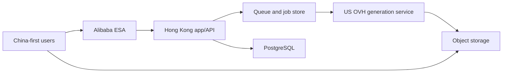

# Architecture

## Current state

The repository is an interactive prototype. Generation uses provider-independent
contracts and typed in-memory repository/provider boundaries, but those mocks
still execute in the frontend process. Projects, assets, and saves also remain
in React memory, and `/public/nano-fashion.png` is the simulated output. The
empty Drizzle schema is intentional. Do not confuse these M1 seams with a
backend, durable queue, or production integration.

## Target production topology

The Hong Kong application is the control plane. The existing US OVH server is
the generation plane. Large image bytes should use signed direct object-storage
transfer whenever possible; do not proxy completed images through the app
server.

## Initial runtime units

Keep one modular codebase and one versioned application image initially. Run it
as two independently restartable processes:

- `web`: UI delivery, authenticated API, authorization, job submission,
  projects, assets, pricing, and account-facing status;
- `worker`: queue consumption, provider routing, polling/callback
  reconciliation, result ingestion, and terminal settlement.

PostgreSQL is authoritative for domain and ledger state. Redis-compatible
coordination may deliver work more than once, so consumers are idempotent and
jobs remain recoverable from PostgreSQL. Object storage owns reference and
generated image bytes. Neither process stores durable state in memory or its
container filesystem.

## Request boundaries

1. Browser authenticates with GoodGood.
2. Browser requests signed reference uploads from the GoodGood backend.
3. Browser uploads reference bytes directly to object storage.
4. Backend validates prompt, model capability, references, quota, and request ID.
5. Backend creates a durable generation job and enqueues work.
6. Worker calls the OVH generation API with server-side credentials.
7. Worker stores outputs in object storage and writes asset/batch records.
8. Browser receives status through polling initially; SSE/WebSocket is optional
   only when measurement justifies it.

## Non-negotiable security boundaries

- No model provider key in client JavaScript.
- No public object-storage write credential.
- Every asset read/write is authorized against the owning user/project.
- Upload MIME, decoded type, size, dimensions, and count are validated server-side.
- Job creation is idempotent and rate-limited.
- Callback signatures are verified; provider payloads are untrusted.

## Capacity posture

The early Hong Kong node may begin as a 2 vCPU / 4 GB control-plane instance if
builds happen in CI and image bytes bypass it. This is not a promise that one
node can handle production persistence indefinitely. The known 50–80 async
generation concurrency primarily belongs to the OVH generation plane.

Upgrade priorities:

1. Separate build from runtime and impose container memory limits.
2. Move images to object storage and add CDN/ESA delivery.
3. Add durable PostgreSQL backups and Redis/job recovery.
4. Scale app workers horizontally before adding in-process state.
5. Separate managed database when availability or migration risk justifies it.

## Provider abstraction

UI model IDs are stable product identifiers. Map them server-side to provider
model/version and capability data. A provider adapter exposes create, status,
cancel where supported, normalize-error, and result-ingestion behavior.

Never branch UI behavior on raw provider error strings.

The US service is a generation gateway, not an extension of the browser or a
GoodGood administrator. It receives a dedicated least-privilege service
credential. Automatic grouping may route between explicitly equivalent
provider routes for the selected GoodGood model, but it must not silently
change model families. Persist route version and each provider attempt so
retries, reconciliation, cost, and support remain auditable.

## Account and billing boundary

GoodGood owns user identity, authorization, product entitlements, versioned
prices, and credit accounting independently of the US generation service. The
backend is the only authority that may reserve, settle, release, refund, grant,
or expire credit. Payment-provider callbacks and generation completion events
are signed and idempotent; the frontend only displays state and initiates
authorized actions.
