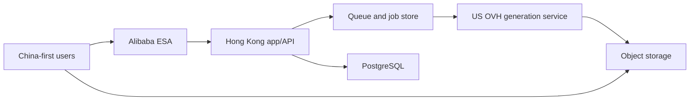

# Architecture

## Current state

M3 implements one production-shaped local generation path: the browser submits
an idempotent request, PostgreSQL transactionally creates a batch, job, audit
event, and queue outbox record, Valkey delivers it at least once, the worker
polls the HTTP mock provider, RustFS stores the image, PostgreSQL records the
asset, and the browser polls the job into the creation stream and asset library.
Worker leases and PostgreSQL reconciliation recover interrupted jobs, while
terminal writes and deterministic object keys tolerate duplicate delivery.

M4 replaces the fixed server-owned identity at the generation API boundary. A
provider-neutral `(issuer, subject)` identity maps to an internal GoodGood
owner before any generation read or write; cross-owner job, retry, and
generated-asset lookup returns no record. The production-shaped adapter uses
Authing discovery and OIDC Authorization Code with PKCE, state, nonce, and a
short-lived HttpOnly cookie binding the callback to its initiating browser.
Both successful and failed callback outcomes expire that one-time cookie. The
backend validates the signed, verified-email ID token, provisions the mapping
on first login, and exchanges it for an opaque, hashed, revocable GoodGood
session cookie. Discovery metadata is cached for at most five minutes; every
authorization request and code exchange fails closed unless the current
metadata still advertises Authorization Code, S256, required scopes, RS256,
and supported server-side client authentication. Provider tokens never become
browser API credentials. Compose
retains a local-only dual-account adapter and HttpOnly default local session as
test infrastructure. Loading that adapter additionally requires
`GOODGOOD_ALLOW_LOCAL_AUTH=true`; OIDC mode rejects the switch so a production
environment cannot silently inherit local test identities. An HTTPS OIDC
callback also makes `Secure` and the `__Host-` cookie prefix mandatory at
runtime, before login or discovery traffic can start.

Explicit logout first revokes the hashed GoodGood session and expires the
cookie, then returns a server-constructed Authing application logout URL for a
top-level browser navigation. Its callback is fixed to the GoodGood origin
derived from the configured login callback. This clears the hosted Authing
application session without retaining an ID Token or accepting a browser-owned
redirect target.

ADR 0020 changes account admission without weakening OIDC identity validation.
Any verified Authing user may establish a GoodGood session, but a newly
provisioned owner starts pending. Session resolution and creation authorization
are separate: the pending session may read only its safe account/review state
and logout, while a shared server capability guard blocks references, drafts,
projects, assets, generation, retry, and credit consumption until approval.
System role, access state, and account tier are persisted independently. A
site-owner-only administration boundary performs account review and promotional
credit grants with server-derived actor identity, idempotency, append-only
ledger entries, and durable audit evidence; no browser action records payment
or directly rewrites a balance.
The implemented access projection uses `pending | active | suspended`; the
initial tier is `seed`, and one immutable `site_owner` assignment is created
only through the dry-run-first server bootstrap. The `/admin/users` browser
boundary can approve, suspend, restore, and grant at most 5000 test credits per
audited operation.

ADR 0022 adds a separate deletion lifecycle without changing that three-state
access projection. A verified account-deletion request immediately suspends
GoodGood access, revokes sessions, and blocks Authing-backed re-entry. A durable
request plus a non-content deletion register must then coordinate owner-account
deletion/anonymization, creative-record and private R2 deletion, Authing
completion, and the 30-day deadline. Credit-ledger and administrative audit
records sever personal linkage and remain anonymized for 12 months after
completion. Backup archives age out through the existing 14 daily / 8 weekly /
12 monthly policy;
an isolated restore must replay the independent deletion register before it is
eligible to serve traffic. Migration 0013 now implements the local durable
request record, request-creation transaction, and queue invalidation field. The
local management UI now supplies the evidence form, two confirmation screens,
and a read-only request summary. Migration 0014 adds the local non-content
register and leased submitted-job wait step. Migrations 0015-0016 add a separate
private-object step, generated-asset deletion marker, digest/count evidence, and
step-specific constraints. Migration 0017 adds the leased creative-record step
and the narrow ledger transformation needed to remove job rows without removing
financial evidence. Migration 0018 adds a provider-neutral leased external-
identity step plus local disable/delete evidence on each identity mapping.
Migration 0019 adds the final leased local completion step, a pseudonymous
owner marker, aggregate local-removal/credit-expiry evidence, and the exact
12-month register-retention boundary. C6-2I adds an opt-in server-only Authing
Management API adapter behind the existing provider-neutral interface. It binds
the configured OIDC issuer exactly, treats the verified OIDC `sub` only as an
Authing `user_id`, looks the user up before mutation, requests `Suspended`
before batch deletion, and accepts only explicit success responses. Authing's
documented user-not-found `apiCode` 2004 is the sole idempotent absence result.
The adapter is not a default and has no credential loader, CLI, timer, runtime
wiring, or production authorization. Register export/replay, cleanup
scheduling, real-tenant evidence, and production operation remain absent.

The implemented local first request entry point stays inside `/admin/users`; it does not
create a new public or member route. The existing site-owner session, POST-only
administration boundary, and CSRF header protect request creation. The browser
presents two distinct confirmation steps, while the backend independently
rejects a request whose target is the acting site owner. A created request
suspends access and revokes sessions atomically, then leaves external/content
steps pending for the asynchronous lifecycle. The account-holder verification
is a manual round trip: request from the current registered email, site-owner
reply to the same address, and explicit user reply within 24 hours. Persist only
the two timestamps and mail provider message/reference ID, never email content,
when the final browser submit creates the request. Before that commit,
dismissing either confirmation changes no GoodGood state.

Deletion request creation also closes the product boundary before asynchronous
erasure begins. Login, generation submit, and user retry are denied. An attempt
whose O1Key submission guard has already crossed the billable boundary keeps
only its existing poll/result-ingest path: no cancellation, new provider POST,
or fallback. The Worker reaches normal success/failure and credit settlement or
release, while any accepted Asset stays private and unreadable to the suspended
owner. Account/content erasure waits for those submitted attempts to become
terminal and then includes their newly ingested private objects.

A queued job that has not crossed the persisted provider-submission guard is
cancelled in the deletion-request PostgreSQL transaction with an exactly-once
credit release and outbox invalidation. PostgreSQL, not Valkey, decides whether
work is eligible. A stale at-least-once Valkey delivery observes terminal
`cancelled`, performs no provider call, and is acknowledged. Owner/job locks and
the submission guard serialize the boundary: a guard committed first follows
submitted-task reconciliation; cancellation committed first forbids submission.

Request creation is a one-way orchestration boundary. The deletion lifecycle
has no withdrawal/reopen transition or restoration API. An incident opened for
an erroneous request is operational evidence only: it cannot reverse the
committed suspension/session revocation, queue/credit closure, destructive
steps, or deletion-register obligation.

The local C6-2A implementation exposes the POST administration boundary.
It locks the target owner and active jobs, writes the request and audit action,
suspends the owner, revokes sessions, releases each eligible reservation once,
marks those jobs terminal, and invalidates their PostgreSQL outbox rows in one
transaction. Authentication-session creation and generation submission lock
the same owner row; the O1Key submission guard locks the job/attempt pair. These
locks choose one race outcome without a cross-store Valkey transaction.
Local C6-2B adds the site-owner evidence form and two browser confirmation
screens. It preserves one idempotency key across a failed-response retry and
reads only request ID, state, creation time, and deadline into each account row;
the mail reference and verified address are not returned in the dashboard.
Local C6-2C creates the register and wait step in the same request transaction.
A bounded in-process service claims due steps with expiring leases and
`SKIP LOCKED`; it locks and counts non-terminal jobs only when an attempt has
crossed the provider-submission guard. Active work defers the step with a bounded
code and next-attempt time. No active work completes only that step, leaving the
request and register `processing`. There is no runtime command, timer, R2 call,
Authing call, content deletion, or production configuration in this slice.
Local C6-2D adds an internal owner-scoped deletion-inventory preview after that
wait step completes. It reads one repeatable-read, read-only PostgreSQL snapshot,
counts projects, jobs, assets, the root draft, references, and distinct live
private-object targets, and binds those rows plus their generation batches into
a versioned SHA-256. Its public result is a strict whitelist of counts, version,
and digest: account/request/row identifiers and object keys never leave the
repository. It has no browser route, persistent inventory row, external adapter,
destructive statement, runtime command, timer, or production configuration.
Local C6-2E consumes that contract only after the submitted-job wait step. One
leased request locks its Asset/ReferenceAsset rows, recomputes and persists the
fresh inventory digest, and returns at most 100 distinct object targets to the
internal service. Each S3-compatible delete completes before PostgreSQL marks
all rows for that key; a missing object is therefore an idempotent success.
Storage failure records only `OBJECT_DELETE_FAILED` and aggregate counts before
a later retry. Lost/ambiguous evidence leaves the lease reclaimable and never
claims success. Ordinary reference retention skips owners with a deletion
request, and asset presentation excludes deleted-byte rows. A still-valid
pending reference-upload intent protects its key until the signed PUT window
and a short clock-skew grace expire, preventing a late upload from recreating bytes after row evidence has
been removed. The service returns and logs aggregates only. There is no browser
route, runtime command, timer, Authing access, production R2 access, creative-row
deletion, or deployment in this slice.

Local C6-2F adds the next leased step only after `delete_private_objects` is
complete. It locks the owner and shared reference lifecycle, recomputes and binds
the current inventory, requires zero live private-object keys, validates that no
cross-owner foreign-key edge enters or leaves the graph, and deletes the
Asset/event/attempt/outbox/job/batch/project/draft/reference graph in explicit
foreign-key order inside one PostgreSQL transaction. Job-linked ledger entries
remain immutable in every normal path; migration 0017 permits only the reviewed
one-time removal of their creative job link while binding that change to the
deletion register and a live creative-step lease. Credit amounts, reasons,
entry relationships, accounts, payment evidence, administrative actions, the
GoodGood owner, Authing mapping, sessions, request, and independent register all
remain. Project, draft, reference-intent, and generation creation now serialize
against the deletion request through the owner row, so committed deletion cannot
be followed by a late creative write. Failure rolls the graph transaction back,
records only `CREATIVE_DELETE_FAILED` plus aggregate counts, and retries safely.
There is still no route, runtime command, timer, Authing or production access.

Local C6-2G runs only after `delete_creative_records` completes. A leased claim
reads a bounded internal set of issuer/subject targets without returning them
to a browser or operator report. The injected provider adapter must make both
disable and delete idempotent; GoodGood records disable evidence first, then
calls delete, then records delete evidence. A provider or evidence failure
leaves the local mapping intact and the step retryable with only bounded counts
and `IDENTITY_DELETE_FAILED`. Completion proves every local mapping has external
delete evidence but deliberately retains those mappings for the next local
anonymization transaction. The default service has no Authing client, endpoint,
credential loader, CLI, timer, or production executor; verification uses only a
disposable in-memory identity directory.

Local C6-2H runs only after every prior step is complete and every retained
identity mapping has external-delete evidence. One PostgreSQL transaction
requires zero creative rows and zero reserved credit, appends an immutable
`expire` entry for remaining available credit, closes the zero-balance credit
account, deletes revoked local sessions before identity mappings, and replaces
the owner's email with a deterministic request-scoped placeholder under
`deleted.goodgood.invalid`. It resets locale, keeps the access state suspended,
sets `anonymized_at`, scrubs the opaque mail reference, and completes the final
step, request, and register with an exact 12-month retention deadline. The
owner UUID remains only as an internal pseudonymous join key, so existing
ledger and administrative rows retain their amounts, reasons, relationships,
metadata, and integrity hashes without being rewritten. Failure rolls the
entire transaction back and records only `LOCAL_ANONYMIZATION_FAILED`; there is
still no route, runtime command, timer, real Authing client, or production
executor.

Local C6-2I does not change the orchestration service or its injected interface.
The new Authing implementation uses the official Node SDK's `getUser`,
`updateUser`, and `deleteUsersBatch` methods with only `user_id`; an exact issuer
mismatch or a mismatched/malformed provider response fails before GoodGood
records success. Provider messages and identifiers never enter its thrown error
messages. A local HTTP fake exercises the SDK request signing and concrete V3
paths. The insecure-host exception is explicit and loopback-only; production
hosts must be HTTPS. Nothing selects this adapter automatically.

Local C6-2J adds one import-only server orchestration boundary around the five
existing leased passes. One invocation observes aggregate lifecycle state,
runs submitted-job wait, private-object deletion, creative-record deletion,
external-identity deletion, and local anonymization in that fixed order, then
observes aggregate state again. Each phase keeps the existing batch, object,
identity, lease, and retry bounds; the cycle creates one stable worker namespace
and still requires an explicitly injected identity adapter. Returned phase
evidence is allowlisted to non-negative aggregate counters, so an accidental
identifier field cannot cross the cycle boundary. An unavailable initial
preview or unexpected phase exception aborts later mutation, while handled
per-item failures remain retryable and let independent later phases inspect
their own prerequisites. The cycle emits only fixed alert codes and a redacted
aggregate summary. It adds no timer, CLI, runtime import, credential loader,
network destination, host unit, or production executor.

Local C6-2K adds a separate recovery boundary rather than routing restores
through the live deletion Worker. The current register is exported as a strict,
versioned, deterministically sorted JSON artifact containing only request UUID,
internal target-owner UUID, lifecycle state, deadline/completion/retention
times, and timestamps. Its SHA-256 binds the exact bytes, and replay additionally
requires the independently supplied expected digest. Against a migrated,
network-isolated restore, completed tombstones transactionally release stale
reservations, remove the owner creative graph, local identities and sessions,
expire remaining credit, close the account, restore five completed step rows,
and apply the source completion/retention times. Processing tombstones suspend
the restored owner, revoke sessions, restore pending steps, retain content for
the normal lifecycle, and force `ready: false`. Repeated completed replay is a
no-op and inconsistent identity/state rolls back the complete artifact. No
artifact writer, backup repository integration, runtime command, or production
restore-script selection existed in C6-2K.

Local C6-2L packages that boundary into the production recovery-point source
without executing it. The reviewed runtime image now contains one recovery
command used only by root-run backup/restore tooling. After a validated custom
PostgreSQL dump completes, a short-lived container on the internal production
state network exports the register. Its immutable image comes from the protected
production release file; any running GoodGood container must resolve to that
same reference and local image ID, while a maintenance stop does not prevent a
backup. Network-none containers then bind the dump, register, immutable image
digest, byte count, timestamps, and both SHA-256 values into a strict version-1
manifest and verify the three files.
Restic stores exactly that root-only three-file set in one encrypted snapshot.
Restore selection accepts only the new recovery-point tags, exact filenames,
one shared stem, and a snapshot no older than the one-hour RPO. The PostgreSQL
restore remains `network=none`/tmpfs; a `--pull never` container from the bound
image shares only that restore network namespace, verifies root ownership,
`0600` modes, component ordering, freshness, and digests, then replays the
register over loopback. Processing tombstones or any mismatch keep recovery
ineligible for traffic. No external provider is reachable from that replay.

Local C6-2M adds a separate production-only, one-shot executor around the
C6-2J cycle without changing the continuously running Web or generation
Worker. Its dedicated configuration boundary accepts only the production
PostgreSQL database, the private `goodgood` R2 bucket, the exact OIDC issuer,
and four file-backed credentials; it neither loads Redis nor mounts the O1Key
or OIDC application secret. The executable verifies PostgreSQL and R2 first,
constructs the Authing adapter only after those checks, runs one fixed-bounds
cycle, emits an aggregate allowlisted result, and exits. A standalone Compose
role supplies state plus egress networks, an already-local immutable image,
read-only filesystem, and explicit CPU/memory/process bounds. A root wrapper
adds one nonblocking host lock and exact file ownership/mode checks. The
systemd source is a five-minute persistent timer over a four-minute oneshot;
nonzero exit status and fixed journal events form the vendor-neutral alert
handoff. These files are checked-in inactive templates only: no management
credential was selected, no timer was installed, and no production endpoint or
Hong Kong host was invoked.

Live C6-2N boundary review found that the current Authing user-pool collaborator
role cannot be represented by a separately identifiable service AK/SK. Authing
returns the global user-pool Access Key ID for `type: userpool`, and rejects the
console's multi-tenant `type: tenant-co-admin` for the internal administrator.
Consequently the checked-in adapter/runtime remain inactive source, and their
future credential mount must not receive the global user-pool secret. The
account-deletion architecture is unchanged; its Authing production edge is a
named external capability blocker until a separately revocable credential or a
new reviewed risk/provider decision exists.

The C6-2O public O1Key contract review establishes only transport lifetimes:
temporary attachment URLs are public for 24 hours and generated image URLs are
retained for 24 hours. The documented asynchronous boundary exposes submit and
GET task-query operations but no delete operation, while the public service
status currently reports privacy policy and user agreement disabled. This does
not prove that provider or upstream copies of prompts, reference bytes, task
records, generated outputs, logs, caches, or backups are erased. The adapter
architecture remains unchanged, but provider-side erasure is now a named
external contract blocker until written terms cover those data classes or a
reviewed provider-boundary change is accepted.

C6-2P now implements ADR 0023 as a separate GoodGood content-safety boundary.
The canonical `seed-v1` policy body is server-owned and SHA-256 bound; immutable
per-owner acceptance is required inside the same owner-locked transactions that
create reference intents or generation/retry jobs. A changed version or hash
fails closed. Reference validation and generated-Asset ingestion produce
`not_reviewed`; only `not_reviewed` and a manually restored `accepted` Asset may
enter ordinary owner presentation joins. This state is explicitly availability,
not semantic inspection. The selected Gemini route keeps upstream default
safety, and GoodGood intentionally adds no keyword list or external semantic
processor.

The report boundary accepts only the caller's live generated Asset and one
server-defined category. One transaction creates an owner-scoped idempotent
report and changes the Asset to `quarantined`; no prompt, bytes, object key, or
free-form allegation is copied into the report. The site-owner dashboard lists
bounded metadata only. Opening one exact preview is a POST action that creates
append-only review evidence before returning a short-lived private URL plus the
live batch prompt. Restore returns the Asset to `accepted`; removal deletes the
private object before recording `rejected` and terminal object deletion. A
failed object deletion leaves the report open and Asset quarantined for safe
retry. Resolution reports and moderation actions retain pseudonymous audit
evidence for 12 months. Existing reasoned account suspension is reused rather
than adding a new account state. ADR 0021's no-fixed-concurrency decision stays
unchanged.

ADR 0024 adds an operator-side `controlled-alpha-v1` release boundary without
changing the application runtime or deploying C6-2P. Its evidence contract
reuses immutable release identity, artifact-security, and production-preflight
evidence, then adds exact-candidate attestations for the maintenance-closed
admission/disclosure baseline, one non-owner end-to-end journey, private
recovery plus maintenance re-entry, and minimum signal/manual-response handoff.
The controlled-alpha verifier and full seed verifier are separate entry points;
the former cannot satisfy or mutate the latter. This preserves the current
deployed migration-0012 runtime while migration-0020 stays a local future-
candidate boundary.

The reference boundary is now implemented locally. The authenticated
web API creates owner-scoped pending records and short-lived signed PUT URLs;
the browser transfers bytes directly to RustFS. Completion re-reads and fully
decodes the private object before marking it ready. A generation request
resolves only ready reference IDs owned by the caller, stores their order and
object keys in its immutable batch snapshot, and the worker resolves those
private objects through the selected provider route. The mock route creates
fresh signed GET URLs; the O1Key route reads the bytes server-side and creates
temporary provider attachments. Browser blob URLs and storage credentials never
enter the persisted generation contract.

M7 keeps this S3-compatible boundary but selects the private Cloudflare R2
`goodgood` bucket as staging's authoritative object store. Server requests and
browser presigned PUT/GET URLs both use the account R2 S3 API endpoint; the R2
public development URL and bucket custom domain remain disabled. The staging
credential has object read/write permission only for that bucket, so startup
verifies the bucket but cannot create it or rewrite CORS. The exact CORS policy
is an independently reviewed Cloudflare setting. The existing same-host RustFS
is a temporary non-authoritative fallback and receives no new staging objects.

ADR 0014 separates database recovery from that application-object boundary.
The root-run staging backup service creates a validated PostgreSQL custom
archive and sends it through Restic client-side encryption to the separate
private R2 `goodgood-postgres-backups` bucket. Application roles and the
application R2 credential cannot read that repository. One persistent daily
systemd timer applies the staging-only `14 daily / 8 weekly / 3 monthly`
policy, prunes, and verifies all encrypted repository data. A failure remains
visible in systemd status and the root journal without automatically retrying
or restoring. ADR 0016 delegates the production-monitoring platform and
notification route to a separate agent. The application-owned correlation
contract remains stable, while activation and live delivery enter the
vendor-neutral production gate as external evidence rather than an M7 staging
claim.
The same tool can decrypt the latest off-host archive into the root-only local
backup directory and pass it to the existing isolated restore drill. The
transient plaintext archive is always removed. ADR 0015 sets the paid-production
database objective to at most one hour RPO and four hours RTO, with at least
`14 daily / 8 weekly / 12 monthly` recovery points; the daily staging schedule
does not satisfy or prove that production objective.

The production Node web runtime creates one server-owned request/support ID per
HTTP request, returns it as `X-Request-Id`, and writes one structured completion
event with the normalized route, status, and elapsed time. It ignores inbound
request-ID values and excludes queries, cookies, credentials, prompts, email
addresses, signed URLs, object keys, and bodies. Successful authentication may
add the internal owner ID, while generation work may add job and provider task
IDs. Worker completion events also identify the provider route, end-to-end and
provider elapsed time, and the immutable customer-credit amount; upstream cost
continues to come from provider usage evidence rather than an invented value.

The M8 production preflight is a read-only Linux-host boundary. It compares one
clean source revision and its derived configuration checksum with an immutable
GHCR digest, the candidate's OCI labels, root-owned runtime/credential files,
and live Authing discovery. Its public report contains only checks, release
identity, and—only after every check passes—one revision-bound evidence item.
It does not own deployment, migration, health promotion, monitoring, recovery,
or checkout enablement; those remain separate evidence and orchestration
boundaries.

Artifact-security ingestion is a separate read-only trust boundary. Main CI
reruns the runtime-import smoke and High/Critical vulnerability scan against the
published digest, then uploads one uncompressed, immutable JSON artifact. The
importer compares the local file SHA-256 with GitHub's artifact digest and
requires the matching successful workflow run, revision, attempt, verify job,
publish job, and named security steps before it emits `artifact-security`
evidence. A downloaded or locally edited JSON file is not trusted by itself.
The production release planner consumes the same full readiness contract and
returns no plan while any evidence is missing, stale, or blocked. Even after a
pass it exposes only abstract ordered phases and has no command-execution path;
production mutation remains unavailable until the concrete traffic-switch and
runtime topology receive an accepted executable adapter.

Reference-byte cleanup is a separate one-shot maintenance boundary, not part
of a browser request or the continuously running worker. Its default dry-run
reports candidates without mutation. Explicit execution first stages expired
pending, rejected, expired, or sufficiently old unreferenced ready rows behind
a grace window, then claims a bounded batch with expiring leases. Generation
and project snapshot writes share a PostgreSQL lifecycle lock and revalidate
ready rows inside their write transaction; cleanup also checks immutable
generation snapshots, current project snapshots, and unexpired creation-draft
snapshots before staging and claiming.
It deletes the private object before recording terminal database evidence.
Failures retain the row and a stable retry code, and repeated execution is
idempotent. Automatic scheduling remains disabled until staging policy and
capacity evidence exist.

M4 now also persists owner-scoped projects. Project create/update validates
that every submitted job and ready reference belongs to the authenticated
owner, then associates batches transactionally. Project reads restore the
latest prompt, ordered ready references, stable model parameters, and every
batch newest-first with fresh private-object signatures. A generation submitted
from a restored project verifies ownership before reference resolution and
updates the project snapshot in the same transaction as its new batch/job.
The shared browser workspace mounts real `/projects` and
`/projects/:projectId` entries over that API. Native history updates the stable
URL without duplicating workspace state, and a direct detail load waits for the
GoodGood session before performing the owner-scoped restore.

The authenticated root creation surface now has a deliberately smaller durable
draft boundary. `GET/PUT/DELETE /api/draft` reads, replaces, or clears exactly
one unprojected draft for the resolved owner. It stores only prompt, ordered
ready references, and stable generation settings, expires 30 days after its
last write, and uses a monotonic optimistic version. The browser serializes its
own writes and stops autosaving on a stale-version conflict until the user
explicitly keeps the current tab or restores the newer server draft. Project
detail state never hydrates from or writes to this root draft; saving the root
context as a project or confirming a clean creation clears it.

The authenticated asset library now reloads successful accepted outputs from
PostgreSQL through `GET /api/assets`. The repository constrains jobs, batches,
and assets to the same resolved owner, sorts by submission time newest-first,
and the presentation boundary signs every private object URL on each read.
Loading, empty, and retryable failure states replace stale in-memory assumptions
after reload; representative mock batches remain available only in no-auth
preview mode. Signed private-object images render directly from browser to
object storage. The shared primitive covers restored draft/project reference
thumbnails as well as generated assets and project covers. These images do not
pass through the application image optimizer, which avoids proxying user bytes,
preserves the expiring signature, and keeps private-IP SSRF protection enabled
for all server-side fetches.

The durable generation capability remains intentionally limited to
`nano-banana-2`, one output, up to 10 validated references, the 14
product-defined aspect ratios, and `1K` / `2K` / `4K`. The browser and O1Key
adapter use the same server-owned, server-validated capability allowlists;
unknown values fail before provider submission.
Primary real Authing/Google/email loopback exchange passes; provider edge-case
and secure public-callback verification remain external evidence work;
billing is active for every newly created generation job. M6 persists immutable
server-owned prices, exact account caches, append-only credit entries, and
composable reserve/settle/release/refund transactions. Banana 2 is 10 credits
for one output at 1K, 2K, or 4K; new and migrated owners receive one 100-credit
welcome grant. The authenticated `GET /api/billing` boundary exposes only exact
available/reserved balances and active product quotes as decimal strings; it
does not expose internal account, owner, ledger, or provider-channel IDs. No
payment UI or real payment provider is configured yet. A local-only fake
payment provider now exercises immutable CNY 10 / 500-credit product versions,
owner-scoped idempotent orders, signed webhook replay protection, and an atomic
paid-order credit grant. An operator-only, dry-run-first command can record an
already received and invoiced business payment as a `manual` provider order and
append the paid-credit grant through the same transaction; no browser admin
endpoint exists. Domestic Alipay is selected for the later customer checkout,
after the production domain is ICP-filed and the merchant product is approved.
The O1Key worker path now has one real
credentialed URL-output loopback smoke plus the accepted at-most-once
submission guard from ADR 0008. New API usage records are the interim source
for upstream charge/refund evidence. Project and asset navigation share one client workspace.
Project index/detail, asset index/detail, and root creation are URL-addressable.
`/create` is the canonical creation URL while `/` remains a compatibility entry
to the same state; future Explore, Moodboards, and Help routes remain deferred.

## Target production topology

The Hong Kong application is the control plane. The existing US OVH server is
the generation plane. Large image bytes should use signed direct object-storage
transfer whenever possible; do not proxy completed images through the app
server.

ADR 0017 selects the provider-neutral initial production runtime adapter without
choosing an infrastructure SKU or changing the documented Hong Kong
control-plane direction: Alibaba Cloud ESA targets one Linux Nginx origin with
two loopback-only Compose application slots.
Only one slot receives Web traffic and only one Worker consumes the production
queue. The inactive Web candidate is checked before a bounded Worker handoff and
an atomic Nginx upstream replacement. PostgreSQL, Valkey, and private R2 remain
outside both slots. Rollback restores the prior Web upstream and Worker but
never downgrades schema. The checked-in planner describes this adapter and has
no execution path.

ADR 0021 selects the already purchased Alibaba Cloud Hong Kong Simple
Application Server as the initial unpaid seed-production control plane. Its
2-vCPU / 4-GiB / 50-GiB boundary temporarily holds Nginx, Web, Worker,
PostgreSQL, and Valkey. Private Cloudflare R2 remains authoritative for image
bytes. This is a deliberate single application/state failure domain, not a
high-availability claim. ADR 0018's separate ECS, RDS PostgreSQL HA, and Tair
profile remains a future scale-out direction rather than a seed-launch gate.

There is no persistent remote staging environment in this phase. The operator
workstation owns mock and production-shaped local testing with test-only data
and credentials; CI produces the immutable candidate. The production host
performs a bounded inactive-Web candidate check, single-Worker handoff, public
synthetic verification, and rollback rehearsal. Local success never substitutes
for production callback, storage, resource-headroom, recovery, or release
evidence. `staging-goodgood.o1key.com` remains reserved and inactive.

The M7 test environment becomes production infrastructure only after a clean
conversion. No staging owner, session, credit, project, job, audit row, queue
item, or object enters production. Fresh PostgreSQL and Valkey state, an
inventory-cleared private `goodgood` R2 bucket with rotated credentials,
rotated production secrets, and an audited site-owner bootstrap define the new
boundary. `goodgood.o1key.com`
remains the canonical application hostname. Domestic Alipay and the applicable
ICP/domain review remain a later paid-commercialization gate. ADR 0021 grants
no data deletion, live configuration change, or deployment authority.

The current Authing application and identity directory are reused, but its OIDC
client secret rotates at conversion. GoodGood has no shared session-signing
secret: fresh PostgreSQL state omits every old hashed session token. Only the
exact `goodgood.o1key.com` production callback/logout URLs remain allowed;
local real-Authing tests may not use the production application. Authing
identity records are not GoodGood accounts: after the clean database reset,
any returning identity provisions a new pending owner with no inherited role,
credit, session, or content before the normal site-owner review boundary.

## Initial runtime units

Keep one modular codebase and one versioned application image initially. Run it
as two independently restartable processes:

- `web`: UI delivery, authenticated API, authorization, job submission,
  projects, assets, pricing, and account-facing status;
- `worker`: queue consumption, provider routing, polling/callback
  reconciliation, result ingestion, and terminal settlement.

PostgreSQL is authoritative for domain and ledger state. Redis-compatible
coordination may deliver work more than once, so consumers are idempotent and
jobs remain recoverable from PostgreSQL. Object storage owns reference and
generated image bytes. Neither process stores durable state in memory or its
container filesystem.

## Request boundaries

1. Browser authenticates with GoodGood.
2. Browser requests signed reference uploads from the GoodGood backend.
3. Browser uploads reference bytes directly to object storage.
4. Backend validates prompt, model capability, references, quota, and request ID.
5. Backend creates a durable generation job and enqueues work.
6. Worker calls the selected server-side generation gateway with a server-only
   credential.
7. Worker stores outputs in object storage and writes asset/batch records.
8. Browser may idempotently save the owner-scoped creative context as a project;
   later project reads re-sign private references and outputs.
9. Browser reloads its owner-scoped accepted assets with fresh signed reads.
10. Browser reads its owner-scoped credit summary and active product quote; it
    never sends a price or balance mutation.
11. An authorized payment client may create an order using only a stable product
    ID and idempotency key. A verified provider callback, or the trusted
    dry-run-first operator command for an independently confirmed receipt, may
    mark it paid and grant only the snapshotted credit.
12. A site-owner browser may review accounts and append promotional credit only
    through the administrator boundary. The backend derives the actor from the
    GoodGood session, checks the persisted role before target lookup, and writes
    idempotent review/ledger/audit evidence without a payment order.
13. Browser receives status through polling initially; SSE/WebSocket is optional
    only when measurement justifies it.

## Non-negotiable security boundaries

- No model provider key in client JavaScript.
- No identity-provider client secret, access token, ID token, refresh token, or
  raw GoodGood session token in client-readable storage or persisted logs.
- Login attempts are one-time and short-lived; OIDC issuer, audience,
  signature, nonce, and verified email are checked before provisioning.
- Consumed login attempts become deletion-eligible after 24 hours; unconsumed
  attempts do so 24 hours after expiry. Expired or revoked GoodGood sessions
  become deletion-eligible after 30 days.
- No public object-storage write credential.
- Every asset read/write is authorized against the owning user/project.
- Every project read/write and batch association is owner-scoped.
- Upload MIME, decoded type, size, dimensions, and count are validated server-side.
- Job creation is idempotent. The initial observation phase has no hidden
  per-user, queue-depth, or concurrent-job count limit; later abuse controls
  require a separate product decision.
- Callback signatures are verified when a selected provider supports callbacks;
  polling and all provider payloads remain untrusted.
- Administrative navigation is not authorization. Every account-list, review,
  role, tier, and promotional-credit operation requires the persisted site-
  owner role and append-only audit evidence.

## Capacity posture

The initial Hong Kong seed-production node is the existing 2-vCPU / 4-GiB
control-plane host; builds happen in CI and image bytes bypass it. This is not a
promise that one node can handle production persistence indefinitely. One
active Worker process starts accepted jobs concurrently without a fixed count
ceiling, while PostgreSQL claims, persisted provider-submission guards, and
ledger transactions remain authoritative per job. SIGINT/SIGTERM stops new
queue intake and drains in-flight work before shared resources close.

Only new generation submit/retry requests pass through host admission. They
pause below 500 MiB `MemAvailable`, at 80% root-disk use, or when those host
observations fail. Protection remains latched until operator review and Web
restart; safe reads and administration stay outside that boundary.

Upgrade priorities:

1. Separate build from runtime and impose container memory limits.
2. Move images to object storage and add CDN/ESA delivery.
3. Add durable PostgreSQL backups and Redis/job recovery.
4. Scale app workers horizontally before adding in-process state.
5. Separate managed database when availability or migration risk justifies it.

## Provider abstraction

UI model IDs are stable product identifiers. Map them server-side to provider
model/version and capability data. A provider adapter exposes create, status,
cancel where supported, normalize-error, and result-ingestion behavior.

Never branch UI behavior on raw provider error strings.

The US service is a generation gateway, not an extension of the browser or a
GoodGood administrator. It receives a dedicated least-privilege service
credential. Automatic grouping may route between explicitly equivalent
provider routes for the selected GoodGood model, but it must not silently
change model families. Persist route version and each provider attempt so
retries, reconciliation, cost, and support remain auditable.

M5 maps the stable `nano-banana-2` product route to O1Key's special-price
`gemini-3.1-flash-image-c-sp` route for one output across all 14 product-defined
aspect ratios and `1K` / `2K` / `4K`. The selected ratio and resolution remain
in the durable job snapshot and are sent unchanged as O1Key `aspect_ratio` and
`size`. The backend-only adapter uses Bearer authentication, uploads each validated private reference to
`POST /v1/o1key/uploads` in stable order, submits `fileData` references to
`POST /async/v1/generateImage`, and polls
`GET /async/v1/tasks/{task_id}`. The temporary upload URL is publicly readable
for 24 hours and is only an intermediate provider-transfer artifact; GoodGood's
private object remains authoritative (RustFS locally and R2 in M7 staging).
Completed outputs must be downloaded promptly and stored in GoodGood-owned
object storage.

Worker routing is explicit and persisted per attempt. The default Compose path
selects the M3 mock route; the O1Key override selects the route above, reads the
ordered private reference bytes, and resumes the persisted `task_id` after a
worker restart. Downloaded JPEG, PNG, or WebP results are bounded, type-checked,
fully decoded, and stored with a content-derived object extension before the
existing terminal job transaction accepts them. A worker whose selected route
does not match an active attempt defers that job instead of polling the wrong
provider.

The documented O1Key image API exposes neither an upstream idempotency key nor
an image callback/signature contract. O1Key confirmed that duplicate POSTs
create distinct charged tasks and that a lost submission response cannot be
recovered through a client identifier or `X-Oneapi-Request-Id`. The adapter
therefore does not invent either field. GoodGood's browser/API submission
remains idempotent. For O1Key, the active attempt is durably moved from
`created` to `submitted` immediately before the billable POST; if the worker is
later reclaimed without a durable `task_id`, it fails as `SUBMISSION_UNKNOWN`
instead of submitting again. An explicit user retry is a new billable request.
Polling is the only accepted MVP status transport. Identical terminal polls are
duplicates, conflicting confirmed terminal polls fail closed, and a new worker
can resume after the provider task ID is durable. One observed `FAILURE` is held
as a provisional candidate and must repeat before the job becomes terminal; a
later non-failure observation clears it. After `SUCCESS`, the returned asset URL
has a bounded delivery-retry window before decode failure is normalized. These
poll/download retries never repeat the paid generation POST. Successful/failed
provider result data must be ingested within its default 24-hour retention
window.

## Account and billing boundary

GoodGood owns user identity, authorization, product entitlements, versioned
prices, and credit accounting independently of the US generation service. The
backend is the only authority that may reserve, settle, release, refund, grant,
or expire credit. Payment-provider callbacks and generation completion events
are signed and idempotent; the frontend only displays state and initiates
authorized actions.

M6 operates behind this boundary. `PriceVersion` selection is server-side and
deterministic; batches retain the selected version, unit, and amount. Each
credit mutation locks the owner/unit account, appends an immutable signed entry,
and updates cached available/reserved balances in the same PostgreSQL
transaction. Identity provisioning grants 100 credits once. Generation creation
reserves 10 credits; an accepted Asset settles it, while a terminal no-Asset
failure releases it. That release includes `SUBMISSION_UNKNOWN` as a customer
policy without claiming an upstream refund. A reservation can close exactly
once through settle or release; one settled single-output generation can
receive one full refund.

Migration 0010 adds an immutable version-1 `credits-500-cny` product whose exact
money snapshot is CNY 1000 minor units and whose grant is 500 credits. Payment
orders snapshot both sides, are unique by owner/idempotency key, and may move
only from `pending` to `paid`. The fake provider uses the public order ID as its
sandbox order reference. Its HMAC callback is timestamp-bounded; accepted event
IDs and exact payload hashes are append-only. The order transition, one payment
ledger grant, and event evidence commit in one PostgreSQL transaction. Repeated
identical events return the recorded result, conflicting event-ID reuse fails,
and later success events for an already-paid order are recorded without another
grant. The temporary manual path resolves an active owner by exact
case-insensitive email, stores a globally unique external receipt as the
`manual` provider order ID, and uses the same immutable order snapshot and
settlement helper. It accepts only a stable product ID, operator identity, and
receipt reference; neither money nor credit amounts are operator inputs. Exact
replay is a no-op, and receipt reuse across an owner or product fails closed.
Customer checkout UI and the domestic Alipay adapter remain absent pending ICP
filing and provider evidence.

ADR 0020's site-owner test-credit path is not a payment adapter. It appends a
positive promotional `grant` and linked administrative audit record in one
transaction, using a server-derived actor and idempotency key. Pending owners
may receive the existing welcome grant and later promotional grants, but the
shared admission guard prevents reservation or consumption until approval.

The read side is deliberately narrower than the ledger. `GET /api/billing`
authenticates before resolving the owner, performs no mutation, returns
`Cache-Control: no-store`, and serializes exact integer credit as decimal
strings. The browser refreshes it after queue acceptance and terminal job
states. Local frontend preview mode may return the same public response shape
from fixed data; the production-shaped Node runtime always reads PostgreSQL.
