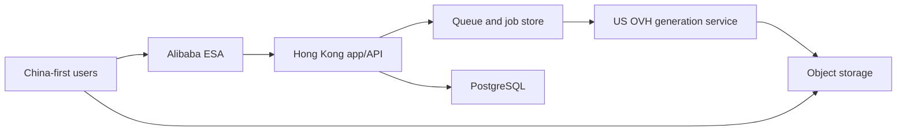

# Architecture

## GG-340 · Platform announcements

`features/announcements` owns the shared entry, safe Markdown rendering,
read lifecycle, HTTP boundary and site-owner editor. No canvas/store hooks or
new provider dependencies are introduced. `server/announcements` owns policy,
transactional repository, Request/Node adapters and Redis/SSE transport.
The domain is platform-scoped: authenticated active users read published posts;
database site-owner checks protect drafts, mutations and statistics.
Publication commits before broadcasting only id/status/publicationVersion.
The existing node-redis client provides one duplicated subscriber per Web
resource set. Streams cap at four per user/process, heartbeat every15seconds,
reauthenticate every60seconds and close during Web shutdown. Transport connect
retries and committed-write broadcast waits are bounded; no new Worker exists.
Visible clients reconnect/poll every30seconds; loaded-ID snapshots reconcile
withdrawals without forcing new posts above the reader. HTML is never inserted;
Markdown nodes render through React, links allow HTTP(S), no image fetching.

## GG-337 canvas original-file download

`canvas-image-download.ts`按节点/资产稳定ID解析下载目标，批次必须指定实际输出ID；已保存图片沿`readCanvasCropImageBlob`原图受权读取，generated先刷新私有下载签名，reference走私有content端点。展示用preview/source URL不参与下载；保留的本地Blob URL仅读取原始File。共享`saveImageBlobToLocal`将原Blob交给浏览器，不经过图像解码或元数据处理，既有资产下载沿同一出口。下载hook按身份/工作区/画布页取消读取与旧反馈，防止过期请求发起下载。没有新API、持久字段或后台更新。见 [GG-337](tasks/GG-337-original-download.md)。

## GG-336 embedded C2PA storage

The browser file boundary adds presence detection independent of EXIF parsing.
JPEG APP11 JPEG XT packets are grouped by instance and repeated root box
header; the root JUMBF description uses the full C2PA store UUID and label.
LBox/XLBox, description fragmentation and metadata between progressive scans
are supported. Clear removes only matching C2PA packets and every PNG caBX
chunk, preserving unrelated APP11 and encoded image/color payloads. Unknown
truncated JUMBF is incomplete detection and blocks ambiguous cleanup; known
C2PA UUID packets can still be removed as a group when incomplete. Ordinary
editing retains embedded credential bytes with an invalidation notice.
The dialog preserves original C2PA status during malformed-EXIF recovery.
No claim/COSE/certificate validation, remote lookup, watermark processing,
dependency, API or persisted fields are introduced; this is not AI detection.

## GG-329 shared canvas flow context

CanvasWorkspace places one explicit ReactFlowProvider above the canvas tool
provider chain and ReactFlow. CanvasImageMetadataProvider can therefore use
useReactFlow to read the same live nodes as the rendered flow; ReactFlow reuses
the existing store instead of creating another. Initial edges, empty default
nodes and the existing 0.1–8 zoom range are preserved. Page/owner dialog cleanup,
canvas persistence and service boundaries are unchanged.

## GG-327 浏览器图片文件元数据

`features/assets/image-file-metadata.mjs` 是无依赖的 JPEG/PNG 容器与 EXIF/XMP 文件边界，编辑常用字段并清除信息，不复制 MakerNote/拍摄原图缩略或 donor 朝向。`canvas-image-metadata.tsx` 管理 Dialog、受权原图/参考图读取、临时表单、取消、下载和副本提交。复用裁剪的受权读取及现有本地上传，添加 `CanvasCropCommit.createCopy` 让所有图片类型都新增旁置副本；裁剪默认行为保持。元数据属于输出文件字节，生成/项目领域记录没有新增字段。无后台凭据、元数据外部服务、生成请求、SQL或运行时更新。

## GG-324 explicit canvas image comparison

CanvasImageCompareProvider scopes an ephemeral modal to the canvas page and owner. The existing crop toolbar exposes the adjacent action across source/result/generator nodes. Resolve references from the actual selected output's owning job input, never the active composer or a sibling slot. The dialog owns source selection and a bounded, disposable preview pool; only an explicit open acquires the existing authenticated canvas-preview derivative (maximum2048), while thumbnails use existing512 routes. Mouse motion stays in the comparison surface and is coalesced to animation frames, leaving asset lists unchanged. Read-only asset/reference/organization boundaries supply partial recovery and current display names. No new API, provider request, schema, project field or runtime activation.

## GG-321 per-request canvas image slots

The generator projects results from stable slots rather than compacting only
successful job outputs. New canvas submissions fan each prompt/count into
independent count1 jobs, with a persisted request key and frozen input per slot;
Seedream's native layer outputs preserve their original job semantics. Initialize
all positions before submitting, and update slots independently so concurrent
completion and a chosen retry do not replace sibling state. Unknown POST recovery
uses the same request key; confirmed failure retries create one normal single-image
attempt. The server's existing generation idempotency/quote/credit rules remain.

Slot persistence extends canvas JSON, not the SQL schema. The project boundary
must validate the slot input and accepted job/reference ownership, remove local
temporary IDs and private runtime URLs, and retain old jobId/jobIds documents.
Each rendered image remains associated with its owning job/output for cropping,
viewing and connecting. A new Web build is required for added cloud fields; current
runtime is kept until the user explicitly delegates activation. See ADR0134.

## GG-318 image failure diagnostics

The image adapter captures allowlisted request metadata and explicit error fields.
A shared sanitizer removes credentials, request content, URLs and opaque data and
bounds strings. Non-enumerable diagnostics keep ordinary errors and task terminal
confirmation fingerprints unchanged. Router/Worker propagation adds attempt/stage;
existing failure and approved channel-fallback transactions persist sanitized job
events with unchanged state/billing. Site-owner operations reads at most 50 events
per task and sanitizes again. No new API, SQL migration, request or infrastructure;
Web and the single real Worker require separate activation.

## GG-308 private text template assets

CanvasMarkdownNode selects between quick actions and format controls using its existing edit state; empty text-generator cards share the disabled quick action. The save dialog freezes Markdown/plain text and a retry UUID. `server/text-assets` owns authenticated owner/workspace-scoped list/create/read/delete with bounded JSON and idempotent content checks; Node and App Router entry points share it. No generation queue, provider, billing or hidden preset instruction participates.

The new text kind reuses asset organization, with a shared row lock on template moves to serialize deletion. Lists carry bounded plain-text excerpts; full text is read only through the authorized asset ID. Both asset surfaces render escaped React text in a square clipped thumbnail, use a cancelable/full-content viewer, and refresh through a scoped asset event. Canvas drops fetch authorized content and copy it into the existing textEditor schema, so project persistence and copied node content do not depend on the asset after insertion. Migration0063 and a rebuilt Web are separate activation steps; old Web returns no template entries and explicit save failure. See[ADR0133](decisions/0133-canvas-text-template-assets.md).

## GG-306 canvas image display derivatives

CanvasAdaptiveImage keeps a native512 preview layer and observes viewport proximity. GG-312 replaces rendered-size/device-density triggers with a fixed canvas zoom>=3 gate: eligible visible images request the fixed2048 canvas-preview endpoint after180ms; below300%, rendering immediately exposes the retained512 layer and releases pending detail subscriptions. An already-decoded blob overlays the retained preview, so failure/downgrade preserves the base. The identity-scoped pool deduplicates detail requests, limits fetch/decode concurrency to3, aborts unneeded subscriptions and retains at most8 inactive object URLs. Local pending Files produce512/2048 display blobs without changing uploads. Source dimensions remain independent of display dimensions.

Asset/reference canvas-preview routes reuse existing authorization/visibility checks and stream a bounded WebP derivative throughSharp (also for locally routed cloud references), avoiding cross-origin redirect fetches. Existing preview/content routes and asset/attachment behavior remain. No arbitrary image transform, new provider call, SQL or object write; backend activation needs a new Web, while old Web leaves the native512 preview usable. See[ADR0132](decisions/0132-canvas-adaptive-image-previews.md).

## GG-303 canvas image prompt batches

Canvas-only separator/job helpers and `canvas-generator-batch.ts` own per-segment concurrent submit/resume/retry. The page freezes inputs once, maintains ordered job slots and aggregate editing locks; the existing generator renders successful outputs in prompt order. Every segment uses the unchanged HTTP generation/provider/billing contract. Cloud graph validation accepts ordered jobIds and resource authorization checks all of them; existing JSON storage needs no migration. Text Markdown rules have an explicit plain-text separator. Current Web activation is separate and not performed by this code-only task. See[ADR0131](decisions/0131-canvas-concurrent-prompt-batches.md).

## GG-291 canvas text generation

GG-297 keeps preset IDs/labels in shared contracts, and full instructions only in `server/text-generation/presets.mjs`. Validation rejects unknown IDs and bounds the resolved preset-plus-user prompt before reservation. Provider calls use resolved input; idempotent snapshots include the preset, while browser history/project JSON contain only its ID/name and user text. Preset requests use `preset-stream`, sharing the ordinary stream's implementation but failing closed on old Web versions. No additional schema or provider calls. See[ADR0130](decisions/0130-text-generation-presets.md).

GG-296 adds server-authoritative interruption billing: succeeded20/cancelled10/failed0. Cancellation and socket disconnect close the locked job once; full settlement plus linked half-refund run atomically, with personal paid-credit provenance and organization member budgets retained. Successful late stops remain20; expiry/server failures still release all.0062 adds actual charge and organization refund relations; it needs migration/build/Web activation, not a browser refresh. See[ADR0129](decisions/0129-text-generation-interruption-billing.md).

The text composer and streaming result reuse `CanvasMarkdownNode`; editing starts with double-click/Enter. `server/text-generation` owns authorization, one relay Chat Completions stream and independent durable text jobs/20-credit transactions. Request IDs prevent repeat execution; reads/cancellation never submit another provider request. Images resolve to existing authorized bytes and are resized only in memory; video inputs carry up to six JPEG representative frames after video ownership checks. No reference upload, image job or Worker queue is created. Project JSON persists draft/history/output and pending request ID; owner/page changes exclude late updates. Backend activation requires0061 and a new Web runtime. See [ADR0127](decisions/0127-canvas-text-generation.md).

## GG-283 generated reference reuse

Canvas generated-image connections retain per-edge state and cancellation while `canvas-generated-reference-import.ts` shares an in-flight request and successful reference by source asset ID. Cancellation releases only its subscriber; the last subscriber aborts the request. Failures are not cached, identity changes/unmount dispose the pool, and asset-library changes invalidate successful results. Existing uploaded references continue to use their original IDs.

The generated-reference API retains owner/workspace authorization and stable reference slots. `createReadyReferenceFromGeneratedAsset` locks the authorized source asset and checks the derived reference before invoking the lazy image preparation callback. Concurrent callers therefore skip original-image reads/normalization as well as duplicate object writes. Preparation failures still roll back, and failed metadata writes retain object cleanup. No schema, provider submission or billing behavior changes. The frontend works with the existing API; the server-side optimization takes effect only after the Web is rebuilt/restarted.

## GG-280 canvas image crop boundary

Canvas crop geometry, export and temporary editor UI stay in small `features/canvas` modules. The canvas page owns node selection, original owner-scoped image resolution and the existing private-reference upload/project lifecycle. Only an explicit Complete action hands a cropped File to that lifecycle; no provider, billing, backend schema or public-cloud credential boundary is added. Source image/result replacement preserves graph identity while generator outputs create a separate image node and keep their immutable job. See [ADR 0126](decisions/0126-canvas-image-crop.md).

## GG-260/261 credit activity source boundary

The shared billing view owns balance, type/project/model/task columns, clipboard feedback and fixed previous/next pagination. The server derives task IDs and authorized project/model metadata from persisted generation records; user labels never create backend enums. New canvas snapshots carry a separate `canvasProjectId`, never a legacy `projectId`; the generation transaction validates owner/workspace and deletion state, freezes the project name, and preserves absent-field legacy hashes. The canvas waits for its first project synchronization before submitting this context. Usage filtering occurs before the server page limit; the frontend also buffers old-server pages without dropping overflow. These reads do not grant credits or trigger generation. Daily free-image policy remains a separate pending decision. See [GG-260](tasks/GG-260-credit-details-and-free-quota.md) and [GG-261](tasks/GG-261-daily-free-image-quota.md).

## GG-238 shared image viewer boundary

GG-249 adds an opt-in canvas mode to this viewer: bounded stage, wheel-driven image/video thumbnail carousel and a caller-provided selected-video renderer. The canvas supplies its existing AssetMedia for playback and URL refresh; the viewer does not import canvas logic. Nearby thumbnail frames alone mount, and wheel normalization/adjacent-index logic is independently tested. Asset-page callers retain the original default layout. See [ADR 0123](decisions/0123-canvas-media-preview-carousel.md).

A small asset image viewer extracts the existing asset detail stage/vertical rail and bounded wheel/arrow interaction for two real callers: the canvas asset panel and uploaded-image asset preview. Callers supply authorized current image scope, identity, name and preview/content URLs; the viewer owns only transient selection/display, loading/retry and dialog focus. The canvas editor, project state and backend remain separate, and existing generated metadata/download detail routes plus video/audio dialogs retain their current orchestration. No new data/provider/API or global CSS dependency is needed. See [task](tasks/GG-238-canvas-asset-viewer.md).

## GG-226 项目列表管理

项目功能放features/projects：name-only PATCH/DELETE边界、确认/错误/待处理状态和只读画布缩略快照。画布原GET/PUT保留，canvas列表补deletedProjectIds过滤已退役本机缓存；项目删除操作不调用素材删除或生成接口。server/projects与server/canvas-projects沿owner/workspace write授权和CAS；画布编辑器/同步器/节点源文件仍由独立会话维护。快照只读取已保存文档、受权素材/任务及本机文件，不启动Worker任务。见[任务](tasks/GG-226-project-library-actions.md)。

## GG-217 platform-coin retirement

JCOIN runtime modules/contracts are removed. Worker no longer imports or schedules
rewards. Web/Next legacy APIs return no-store 410 without platform-coin resources.
Normal generation queues, credit settlement and refunds remain independent.
Historical migration0040 and its schema definitions remain; no drop/reset occurs.

## GG-218 canvas page boundaries

一个项目CAS保存有序多页文档，旧v1通过共享契约归为页面1，新v2 pages每项复用现有graph字段。服务端逐页结构验证并保持全项目上限，拒绝已有v2降级写；0055已在隔离本地应用，仅放宽JSON版本CHECK。本地同步签名涵盖全部页面内容而排除页视角/激活偏好；云端投影逐页剥离pendingFile/localJob等浏览器临时字段。前端保持一个ReactFlow视图，页graph/历史各自保留，后台上传/生成按全项目唯一node/page IDs定位，切页不取消任务或重发请求。

## GG-214 Seedream provider and pricing boundary

共享seedream-models定义产品ID、provider ID、文档像素表和参考图附加费。O1Key路由使用dola-seedream-5-0-pro-260628-ep，以单任务n1、PNG和images URL字符串提交；不传watermark/layer_decomposition，不使用GPT引用格式或扇出。仅Seedream允许实际输出1..17，adapter/router/Worker/完成事务共用数量规则；全部解码和存储完成才原子提交，任一失败清理暂存对象。前端与个人/企业积分预留共用精确报价转换，服务端冻结总额；真实provider凭据仍仅服务端。普通生图默认，拆层入口及图层编辑未包含。

## GG-213 canvas-only GPT automatic size

The canvas ratio options and resolver accept adaptive for GPT without widening lobby fixed-ratio capability. Generation API passes routingPolicy into input validation; only canvas-image-v1 may combine GPT with adaptive. Adapter validation gates adaptive by the selected canvas route and persisted policy; the provider payload maps it to size:auto. Fixed sizes/routes, quality-specific prices and prior accepted input hashes remain as stored. Model quality defaults already normalize to auto; frontend new drafts now use it explicitly. Existing optional draft fields handle the Switch's transparent+PNG/auto state; no migration or price publication is needed. Recorded mock contract validation reads GPT size directly (no separate aspect_ratio) and accepts documented auto. Local isolated257f959 replaces99e645c, preserving all local state.

## GG-211 / GG-212 versioned canvas image submission

New canvas snapshots carry `routingPolicy: canvas-image-v1`, frozen in the input hash and nullable `generation_batches.provider_routing_policy`. Canvas GPT routes select documented resolution IDs: GPT2 `gpt-image-2-c-sp/-c-sd`, GPT2.5 product ID plus `-sp/-sd`; 4K-only backup uses the base ID. Lobby/legacy jobs keep their original route identities and native GPT counts1/2/4. Each new canvas multi-output batch uses recoverable single-image task-set fan-out through12 and existing exact-count/atomic storage and billing. Shared model capability accepts1..12; the API enforces legacy entry bounds when the marker is absent.

The adapter marks only explicit structured no-channel rejection, with no accepted taskID and no auth/quota/rate-limit/parameter/moderation failure, as safely declined. The worker transaction closes that primary submitted attempt and creates a separately pinned backup attempt once, retaining reservation and frozen input. Recovery chooses the active attempt's pinned backup route; submission uncertainty never triggers a backup. Quality/background/output format pass through generator draft, snapshot, exact quality quote and provider payload. Migration0052 extends only batch/price counts and missing active prices;0053 adds the policy column. Local runtime99e645c is isolated from the dirty frontend and production.

## GG-203 canvas Nano count eight

The shared generation/billing count types include 8, while lobby count choices retain 1/2/4. Canvas-specific options and count resolvers permit 8 only for Nano Banana 2/Pro. Server capabilities permit the same adapters; their existing provider fan-out issues eight single-image tasks and incrementally stores an ordered task set. Provider result normalization still expects one output for each Nano task, then the existing worker/repository enforce exactly eight assets before atomic completion and settlement. Managed-price publication and billing summary iterate each adapter's supported counts; count-eight requires a real active quote. Migration 0051 opens only generation-batch and price count checks and appends eight-times-single prices per enabled Nano line. Canvas JSON validates 8 without a new schema version; its generation requests keep `projectId:null`, leaving legacy lobby draft/project constraints unchanged. No provider payload `n=8` or partial success flow is introduced.

## GG-189 canvas adaptive ratio and Pro multi-output

Canvas drafts persist the domain ratio `adaptive` without changing the project document schema version or the generation batch column type. The generation validator allows it for both Nano adapters only; the O1Key adapter omits the `aspect_ratio` field for that value. Banana task fan-out already creates one provider task per requested image, so Pro 2/4 use the same task-set persistence and completion path as Banana 2. Billing must find an active count-specific price version before enqueueing; migration 0050 derives initial Pro 2/4 versions from each active single-image price, and later admin edits generate all counts. The current 5173 proxy to old 32131/32142 cannot execute this source change until a controlled local runtime update.

## GG-167 canvas generator nodes and connected image references

`canvas-workspace.tsx` keeps React Flow nodes internally owned and edges controlled by `CanvasPage`, adding a `sourceImage`/successful `imageResult` source Handle and an `imageGenerator` target Handle. The generator uses React Flow's `NodeToolbar` so the existing composer follows its selected node at screen scale without becoming part of the zoomed node geometry. A temporary page map keyed by generator ID owns prompt, model, ratio, resolution, count and directly uploaded reference files. Each controlled edge belongs to one target generator; the active reference tray and immutable generation input snapshot merge that generator's direct files with its incoming edges, counting both toward ten. Node/edge removal cancels pending client imports and removes transient input state. There is no canvas document endpoint or schema.

Local `sourceImage` uploads already return a `reference_assets` ID after the existing signed PUT/completion flow. An image dragged from the asset library carries its true `reference` or `generated` kind and ID into the node. `imageResult` outputs and `generated` library assets are **not** reference IDs; the new owner-scoped `POST /api/references/from-asset` must validate the generated asset and create or reuse a ready private reference before a connected edge can be submitted. Until conversion returns ready, the edge is visually pending and the generation gate stays closed. The browser never fetches cross-origin signed source bytes for conversion. The 5173 frontend's current 32131 `b12f699` runtime predates this route and must be replaced with a reviewed local checkpoint for that path to work.

## GG-161 canvas local media upload

Computer-dropped JPEG/PNG and MP4 nodes use one canvas orchestration path while retaining their existing upload clients. Images reuse the owner-scoped reference intent, signed PUT, completion and status recovery, then read through `/api/references/:id/content`. MP4 files reuse the private video material intent, signed PUT, completion and status route, then obtain a signed read URL from the owner-scoped video list. Optional abort signals now cross each request and retry delay. React Flow owns temporary node state, local `File`/Blob previews and retries; successful assets live in existing private library records, while canvas positions remain unsaved. The open sidebar invalidates its existing lists after upload completion. Signed video read errors trigger a new authorized list read; no stable video content proxy is added. Existing library-item drag, generation nodes and audio are separate paths. No new endpoint or schema is required; the 5173 UI still proxies to the existing 32131 runtime.

## GG-155 canvas library drag and asset names

The canvas asset panel keeps the owner-scoped list response as the only source of draggable items. It passes an item identity and existing private read URL to `canvas-page.tsx` through an in-page drag reference; a branded DataTransfer type identifies the gesture without trusting a foreign drop payload. Generated images resolve the original URL through the existing download-url boundary on drop. Uploaded image/video/audio materials reuse their list URL. React Flow receives a temporary image/video/audio node, never another upload or generation request. The audio node uses native controls; its storage URL is not re-hosted. Existing local blob cleanup now revokes only URLs created by the canvas, so removing a library node cannot revoke a remote signed URL.

Asset display names live in nullable `asset_organization.display_name` (migration 0048), shared across generated/reference/video/audio kinds. `PATCH /api/asset-organization/items/:kind/:assetId` checks the concrete owner's ready/accepted asset and writable workspace before upserting its alias. Existing `PUT` organization updates preserve the alias, including a move back to an unclassified folder. Both Next and Node local runtime handlers expose the same operation. The original uploaded filename, private object key, asset ID, and generation history remain unchanged. A 5173 UI session currently proxies all `/api` calls to the separately verified 32131 checkpoint; this new PATCH path cannot work there until an explicitly reviewed local runtime replacement and migration 0048.

## GG-233 canvas library add boundary

The canvas asset panel adds an explicit file/link entry ahead of library cards. It reuses the existing image reference, private video and private audio upload boundaries plus asset organization for the current folder. GG-245 replaces browser CORS downloading with authenticated `POST /api/references/read-link`: validate active owner/workspace before a bounded public-only HTTP(S) read, validate every DNS answer and pin the connection on every redirect, preserve TLS host checks, and forward no remote credentials. Decode bounded JPEG/PNG through existing reference validation, return private uncached bytes without persistence, then send the resulting File through the original private upload/completion path. Only ready server records become draggable items; upload and folder-assignment failures remain distinct. No provider, Worker, schema or canvas graph change. See [ADR 0122](decisions/0122-authenticated-public-image-link-read.md), which supersedes the original GG-233 browser-only boundary.

## GG-151 canvas asset browser

`canvas-workspace.tsx` inserts an icon-only library trigger into the existing React Flow lower-left `ZoomSelect` Panel. `canvas-page.tsx` owns the open state and CSS sidebar width; opening mounts `canvas-asset-panel.tsx` above the left edge of a full-viewport React Flow container. The header, composer, MiniMap, ZoomSelect and drop cue follow the sidebar width; React Flow bounds and node coordinates stay unchanged. New generation placement derives its center from the visible area to the right of the overlaid sidebar. The panel reads existing personal asset, reference, video, audio and organization boundaries in parallel, maps them to a read-only list, and filters folder membership by the existing `(kind, id) -> folderId` arrangement. Private images use the existing native signed-URL image component; hover/focus previews use the shared tooltip primitive. The panel adds no endpoint, stored canvas document, mutation, provider request or schema change.

The sidebar edge captures pointer movement (and accepts keyboard arrows) to set a page-local preferred width. Pointer events update a pending value; a single animation-frame callback writes a temporary CSS width for the sidebar and overlaid controls, so the layout follows the pointer without a React rerender for every raw event or a resize of the React Flow host. Pointer release commits the preferred width to page state, and cancellation removes the temporary width. The default remains 248px and the desktop maximum is 400px. No new resize observer or saved layout record is added.

## GG-146 local canvas video nodes

`canvas-local-images.mjs` now validates local MP4 drops against the existing 20 MiB video contract while leaving the composer reference picker image-only. `canvas-page.tsx` creates an object URL and a temporary React Flow `sourceVideo` node; `canvas-video-node.tsx` reads native pixel dimensions/duration and owns the muted HTML video element. `canvas-video-metadata.ts` lazy-loads MediaInfo WASM in the browser, serializes local-file reads, and supplies file-derived FPS only. The WASM is a cacheable static asset; no video bytes or parsing jobs reach GoodGood's backend. React Flow holds resize dimensions separately from original metadata. Removed nodes and page teardown revoke object URLs. No storage, billing, generation or schema change is added.

## GG-145 canvas image metadata

Canvas metadata remains local to React Flow nodes. Local files supply `File.name` and decoded natural pixel dimensions; generated outputs supply backend original dimensions when present and use the existing asset download filename rule for display. Loading a local file can fill missing dimensions; generated 512px preview dimensions are not used as original dimensions. Neither source changes the persisted asset schema or the node's resized CSS width/height. The shared metadata view renders above image pixels, not in the generation or private-asset API.

## GG-126 local canvas image ownership

`features/canvas/canvas-local-images.mjs` validates desktop files using the existing private image type/size contract and computes drop positions. `canvas-page.tsx` owns temporary `File` objects and object URLs; React Flow `sourceImage` nodes render them without a network request. Only an explicit “use as reference” action passes the original file through `uploadReferenceFiles` into the existing owner-scoped reference service. Object URLs are revoked when their node/tray entry is removed or the page unmounts. A canvas node removal is local UI state and does not delete a previously uploaded reference or any durable asset. No canvas API or database migration is added.

## GG-125 standalone canvas boundary

`app/canvas/page.tsx` mounts a dedicated client surface instead of `app/page.tsx`'s lobby shell. The canvas page reads the existing session and billing summary, uploads private references through `features/references/http-reference-upload.ts`, and submits image snapshots through `features/creation/http-generation-boundary.ts`. React Flow nodes represent the current page's observed job state and are not persisted; successful jobs and assets remain owned by the existing backend. No new provider, billing, database or canvas API is introduced.

## GG-121 asset deletion boundary

The asset selection bar calls the existing generated-image deletion endpoint
or `/api/asset-files/:kind/:assetId` for uploaded references, videos, and
audio. `server/assets/api.mjs` validates the fixed kind set and UUID, checks
workspace access and concrete file ownership, removes folder metadata in the
same transaction as the row change, then deletes private bytes. Reference
rows become inaccessible tombstones so profile/history foreign keys remain
valid; video/audio rows are removed. The local Node API and Next route expose
the same operation. There is no schema migration or provider call.

## GG-115 asset boundaries

`features/assets/asset-workspace.tsx` presents history and personal library
over the existing generated, reference, and video lists plus private MP3
materials. `features/assets/http-asset-organization.ts` and
`server/assets/organization.mjs` own optional folder/tag metadata; these
queries check workspace membership and the actual asset owner before writes.
`server/audio-materials/` follows the existing signed direct upload and
post-upload validation pattern. `server/assets/cleanup-unfinished-upload.mjs`
handles expired pending/rejected video and audio objects without touching ready
materials. New upload contracts live in `shared/contracts/upload-limits.mjs`:
20 MiB each, JPEG/PNG/MP4/MP3. Preview cards continue through the reusable
owner-checked 512 px WebP route; detail and download retain original semantics.
The older GG-105 limit below is historical and superseded by ADR 0102.

GG-105 historically raised private reference originals to 200 MiB, matching private video
materials, while the Worker still derives image model inputs within its per-file
and batch budgets. Signed PUTs have a 30-minute window; private object reads
avoid a second full-size byte copy. Avatar and editor export limits are separate.

GG-104 adds `server/video-materials` for owner-scoped signed upload intents,
R2/RustFS object validation, status, and reusable video listing. Browser files
travel directly to private object storage using a short-lived signed PUT;
the browser never receives storage or provider credentials. Image uploads keep
the existing reference API. The video picker uses signed private reads; video
generation remains text-only when references are present. Both Node and
framework routes share the same service.

GG-093本地版本交接由`scripts/local-build-provenance.mjs`绑定Git revision、源码指纹和`dist/client`/`dist/server`产物指纹；`scripts/local-checkpoint.mjs start`只允许本地mock依赖并在导入Web前注入已验证身份。`/api/health/version`不参与业务鉴权，仅报告当前进程是否由该受保护流程启动。

GG-091独立account-invitations验证器与0043用户插入触发器自动分配唯一六位码；邮箱事务验证正确邮件码/预期email后共享锁活动邀请者，再记录account_invitation_uses并提交账户/欢迎积分/Session/挑战。邀请码无限复用，注册者邀请关系唯一；不消耗原码。旧0042仅历史表，旧后台操作路径移除。

GG-090独立server/auth/invitations.mjs与共用invitation-http连接Node/框架API；邮箱事务在邮件码正确后锁邮箱/owner/邀请码，一次提交新active用户或旧pending开通、欢迎积分（仅新用户）、邀请码使用、Session和challenge消费。OIDC仅允许已有绑定登录，无自动注册旁路；local仅已有身份。后台在DB再次验证活动站长。

GG-087隔离features/feedback、server/feedback及shared/contracts/feedback；框架与Node共用有界multipart/http服务，session认证允许非活动用户联系站长，DB再次核对管理角色。专用私有对象通过同源认证图片API读取，不走references/资产库/provider；创建锁用户+内容指纹幂等，站长版本/动作锁保护回复。

GG-117 removed features/inspiration, server/inspiration,
shared/contracts/inspiration.mjs, the app/inspiration pages and the
/api/inspiration routes, together with their navigation entries and tests. The
five inspiration tables are dropped child-first, so no module in the running
application reads or writes them any more; `server/assets/api.mjs` no longer
probes for a published case before deleting an asset. See
[ADR 0104](decisions/0104-inspiration-feature-retirement.md).

历史GG-084（已退役）曾以features/jcoin、server/jcoin和shared/contracts/jcoin隔离运行时；app/page仅路由/导航接线。个人DTO显式投影自身统计/记录，平台计划只走站长API且数据库再次验证活动角色。独立处理器从已结算credit ledger核对真实manual支付与历史划拨，不在消费/退款事务中同步发币。Worker每15秒单飞处理一批至多200条，PG全局事务锁与唯一source使多Worker/手动重放幂等；失败仅记录事件/错误码，原生成队列继续。暂停/发完仍处理已奖励消费的退款，原消费时间决定资格与稳定分发顺序。仅一期生命周期，后续批次管理另行实施。

GG-081通用积分入账端点复用身份/CSRF、事务与管理幂等。充值与manual命令共用凭证互斥，通过正常PaymentOrder与payment_funded账本原子入账；内部按数量不可变价目不进入客户目录，也不能经客户支付接口创建。其他五类为non_transferable。看板只读已确认manual订单现金和任务运行区间，假支付排除。见[ADR0080](decisions/0080-classified-admin-credit-grants-and-operations.md)。

GG-072 places profile UI/state under features/profile, owner service and Node
handler under server/profile, and framework API under app/api/profile. Existing
personal assets supply the works and validated private reference uploads supply
avatars. DTOs contain display identity, version, reference ID and signed URL,
never raw provider identity/credentials. No cross-user API or provider call.

GG-071 isolates read-only operations SQL/services in server/admin/operations*
and feature UI/http boundary in features/admin/site-operations-view and
http-operations-boundary. Both runtime Node dispatch and framework POST routes
enforce authenticated site-owner reads with CSRF/no-store/normalized errors.
Personal and enterprise ledgers normalize known units and exclude denomination
exchange grants. Detail DTOs whitelist submitted parameters and error codes;
provider payloads, prompts, URLs and arbitrary metadata stay server-side.

GG-070 changes only the owner presentation: model cards summarize the current
default-line specification matrix; existing edits/additions use Radix Sheet on
the same route. No new API, price semantics, persistence or provider behavior.

GG-069 shares exact cent-based batch discount calculation and a reusable
current-route draft editor for image/video pricing. Existing owner saves publish
final prices; discount metadata is editing-session state only. No new API,
provider request, migration or settlement path is introduced.

GG-068 shared Seedance specifications drive admin template order/resolutions and
provider payload validation. 2.5 accepts 1080p; UI resolves it unchanged and
rejects 4K. Independent standard/backup prices use existing owner APIs and JSON
persistence; existing server-only route IDs are unchanged. No paid verification
or formal video settlement is added.

GG-067 introduces shared completion-token parsing/calculation and a video-only
pricing editor. Existing owner-only save/query APIs persist billing-tagged JSON
prices with optimistic versions and audit snapshots. No provider call, new
route, schema migration or formal video settlement is added.

GG-062 extends image-line eligibility to GPT templates while keeping Banana-only
thinking/search and per-image provider orchestration separate. GPT routes carry
the exact user-specified -sp/-sd/base model IDs and retain single-request n=1/2/4.
Explicit lines select new immutable routes; null historical GPT jobs select legacy
routes. Price contexts remain isolated by catalog model and line.

## GG-057 site-owner navigation boundary

ADR 0067/GG-059 supersedes the standalone chrome below: management routes mount
the creation shell and inject its session into embedded views. GG-061 adds
`/admin/audit` and `features/admin/audit-log-view.tsx`; `readAuditLog` extracts
only recentActions from the existing site-owner-authorized dashboard query,
requesting one account row while retaining the fixed latest-30 action query.
No new server endpoint, persistence or write workflow is introduced.

`features/admin/admin-management-header.tsx` is shared by the two standalone
management pages after session/access/site-owner gates. Direct page links do
not perform authentication. The authentication Node handler passes the current
request to `beginLogin`; explicit local mode preserves its valid identity or
restores the configured default with a validated return path. Production modes
retain their existing authentication and authorization. No persisted data or
pricing contract changes.

## GG-052 local model-management boundary

`server/admin/models.mjs` owns authenticated directory reads, site-owner saves,
template/price validation and immutable audit/price publication in one
transaction. `features/admin/model-management-page.tsx` edits RMB and converts
at exactly 100 credits/CNY; it never configures credentials or arbitrary provider
URLs. Catalog IDs select independent products over canonical adapter templates.
The creation composer reads enabled models and quotes; the backend rechecks
model availability and optional expected quote version before credit reservation.
Disable or reprice after acceptance does not cancel or reprice that job. Existing
draft/project boundaries persist catalog ID independently from adapter ID. The
denomination exchange uses new accounts and append-only history, not mutation
of historic ledger/price/order/job records. Video prices are configuration and
second-based trial quotes until durable video billing is added.

GG-054 separates stable product `imageLine` (`special / quality / dedicated`)
from server-only provider IDs. Shared line contracts drive UI/pricing validation;
the provider router resolves the exact model and line on worker claim/recovery.
Banana aliases use their canonical adapter mapping. Admission locks model/line
availability and line-specific immutable pricing in the reservation transaction.
Accepted jobs do not reread enabled flags and cannot silently switch lines.
Pro retains count 1 and the ten standard Gemini ratios. GG-056 connects both
Banana models' three owner-confirmed routes; Banana 2 retains per-image task
orchestration and its legacy special route/version. No provider IDs/credentials enter creator UI.

GG-056 `archiveManagedModel` locks the catalog version, disables/archives the
entry and appends its audit atomically. Catalog reads and new admission exclude
archived rows; normal saves cannot reuse an archived ID. Accepted task recovery
continues from its original snapshot. The operation removes the specified local
trial entry without adding a browser delete route or deleting historical data.

## Current state

The live application is an owner-reviewed controlled alpha: browser → GoodGood
Web/API → PostgreSQL + Valkey → one concurrent Worker → O1Key → private R2.
Authing supplies validated external identities; GoodGood owns account review,
sessions, authorization, creative data, and the credit ledger. The Hong Kong
single host and local-only preproduction topology follow ADR 0021; ADR 0024
narrows launch scope without claiming the full seed gate. Deployed identity
and verification are maintained in `docs/CURRENT_STATE.md`.

The following sections describe how these boundaries evolved. M3's mock and
RustFS path remains local test infrastructure, not the current live provider.
Deferred C6 deletion/content-safety code is isolated on the archive branch;
accepted ADRs for it do not mean its later migrations are deployed.

## Implementation evolution and contracts

The next selected authentication boundary is GoodGood-owned email OTP with a
managed mail-delivery provider, documented in [ADR 0045](decisions/0045-goodgood-owned-email-otp.md)
and [the rollout plan](EMAIL_AUTH_PLAN.md). GG-029 implements the P1 runtime,
P2 browser/operations surface, and P3 local release-preparation boundary in an
isolated candidate. Its read-only
operations report aggregates redacted authentication events and a cleanup
heartbeat, while an existing owner-review transition performs targeted session
revocation. The production preflight is mode-aware and verifies SMTP connection/
authentication without sending mail. A dry-run-first manifest tool adds a random
email identity only to an exact existing owner after matching its stored email,
prior non-email identity, reviewed manifest digest, and site-owner verification.
It does not mutate account, role, credit, asset, or project records. Per ADR 0016
these signals do not install a monitoring collector or notification transport.
The OIDC contracts below still apply to the deployed runtime until a separately
approved cutover.

M3's deterministic automated-test path submits
an idempotent request, PostgreSQL transactionally creates a batch, job, audit
event, and queue outbox record, Valkey delivers it at least once, the worker
polls the HTTP mock provider, RustFS stores the image, PostgreSQL records the
asset, and the browser polls the job into the creation stream and asset library.
Worker leases and PostgreSQL reconciliation recover interrupted jobs, while
terminal writes and deterministic object keys tolerate duplicate delivery.
Outbox dispatchers atomically claim rows before publishing to Valkey, and
reconciliation only reopens a dispatched row after the Worker lease window.
The active Worker ignores a second delivery of an in-flight job, and any
unexpired lease blocks another claim even when the Worker identity matches.
After object upload, the Worker reports success only when the asset and job
terminal state commit together; a terminal loser removes its unaccepted object.
ADR 0092 keeps that mock path test-only; runnable local development replaces the
provider boundary with real O1Key while retaining isolated local state.
The creation client owns a stable run key per click so the temporary pending job
and later durable job remain one visible run. It keeps an unbounded registry of
overlapping active and failed runs; this is presentation state, never provider
identity or queue authority.

M4 replaces the fixed server-owned identity at the generation API boundary. A
provider-neutral `(issuer, subject)` identity maps to an internal GoodGood
owner before any generation read or write; cross-owner job, retry, and
generated-asset lookup returns no record. The production-shaped adapter uses
Authing discovery and OIDC Authorization Code with PKCE, state, nonce, and a
short-lived HttpOnly cookie binding the callback to its initiating browser.
Both successful and failed callback outcomes expire that one-time cookie. The
backend validates the signed, verified-email ID token, provisions the mapping
on first login, and exchanges it for an opaque, hashed, revocable GoodGood
session cookie. Discovery metadata is cached for at most five minutes; every
authorization request and code exchange fails closed unless the current
metadata still advertises Authorization Code, S256, required scopes, RS256,
and supported server-side client authentication. Provider tokens never become
browser API credentials. Compose
retains a local-only dual-account adapter and HttpOnly default local session as
test infrastructure. Loading that adapter additionally requires
`GOODGOOD_ALLOW_LOCAL_AUTH=true`; OIDC mode rejects the switch so a production
environment cannot silently inherit local test identities. An HTTPS OIDC
callback also makes `Secure` and the `__Host-` cookie prefix mandatory at
runtime, before login or discovery traffic can start.

Explicit logout first revokes the hashed GoodGood session and expires the
cookie, then returns a server-constructed Authing application logout URL for a
top-level browser navigation. Its callback is fixed to the GoodGood origin
derived from the configured login callback. This clears the hosted Authing
application session without retaining an ID Token or accepting a browser-owned
redirect target.

The email candidate replaces external identity proof with a browser-bound,
short-lived challenge. GoodGood stores only a keyed code digest, enforces
mailbox/IP/global limits in PostgreSQL, sends through one bounded SMTP adapter,
and atomically consumes the challenge while resolving or creating a random
`urn:goodgood:email` identity and opaque GoodGood session. New owners still
start pending. Delivery, identity, account review, authorization, and business
ownership remain separate; email mode does not accept provider tokens or fall
back to local fixtures. Existing-owner migration never infers ownership from an
email alone: the reviewed owner ID and current stored email must agree, and the
new binding records its manifest, operator, and reference hashes for exact replay.

ADR 0020 changes account admission without weakening OIDC identity validation.
Any verified Authing user may establish a GoodGood session, but a newly
provisioned owner starts pending. Session resolution and creation authorization
are separate: the pending session may read only its safe account/review state
and logout, while a shared server capability guard blocks references, drafts,
projects, assets, generation, retry, and credit consumption until approval.
System role, access state, and account tier are persisted independently. A
site-owner-only administration boundary performs account review and promotional
credit grants with server-derived actor identity, idempotency, append-only
ledger entries, and durable audit evidence; no browser action records payment
or directly rewrites a balance.
The implemented access projection uses `pending | active | suspended`; the
initial tier is `seed`, and one immutable `site_owner` assignment is created
only through the dry-run-first server bootstrap. The `/admin/users` browser
boundary can approve, suspend, restore, and grant at most 1,000,000 test credits per
audited operation (RMB 10,000 at 100 credits per CNY; migration 0044).

The reference boundary is now implemented locally. The authenticated
web API creates owner-scoped pending records and short-lived signed PUT URLs;
the browser transfers bytes directly to RustFS. Completion re-reads and fully
decodes the private object before marking it ready. A generation request
resolves only ready reference IDs owned by the caller, stores their order and
object keys in its immutable batch snapshot, and the worker resolves those
private objects through the selected provider route. The mock route creates
fresh signed GET URLs; the O1Key route reads the bytes server-side and creates
temporary provider attachments. Browser blob URLs and storage credentials never
enter the persisted generation contract.
GG-103 uses those blob URLs for immediate tray previews and limits direct PUTs
to two at a time. An owner-scoped upload-status read reconciles completion
requests whose HTTP response times out after server validation succeeds. The
O1Key image Worker prepares ordered provider input copies from the private
originals before billable submission: at most 10,000,000 bytes each, 32,000,000
bytes total across up to 10 references, 4,096 pixels per edge and 8 million
pixels per copy. Copies are temporary; reusable originals remain intact. These
are GoodGood limits for its current O1Key route, not one shared official API
limit for Gemini and OpenAI.
An authenticated reference-list read exposes the same accepted rows as reusable
materials, newest first, and signs their private objects without returning raw
object keys. Composer reuse submits the existing stable reference ID, so the
upload path and provider attachment path remain unchanged.
The browser quick editor reads one ready material through the authenticated
`GET /api/references/:referenceId/content` boundary. The server rechecks owner,
ready/accepted state, and deletion state before returning private bytes with
`no-store`; this avoids depending on cross-origin object URLs for Canvas while
keeping storage keys and credentials out of the browser contract. Edited pixels
are uploaded as a new reference record, and a project edit synchronizes the new
ordered reference snapshot before the tray replacement is reported as saved.

M7 keeps this S3-compatible boundary but selects the private Cloudflare R2
`goodgood` bucket as staging's authoritative object store. Server requests and
browser presigned PUT/GET URLs both use the account R2 S3 API endpoint; the R2
public development URL and bucket custom domain remain disabled. The staging
credential has object read/write permission only for that bucket, so startup
verifies the bucket but cannot create it or rewrite CORS. The exact CORS policy
is an independently reviewed Cloudflare setting. The existing same-host RustFS
is a temporary non-authoritative fallback and receives no new staging objects.

ADR 0014 separates database recovery from that application-object boundary.
The root-run staging backup service creates a validated PostgreSQL custom
archive and sends it through Restic client-side encryption to the separate
private R2 `goodgood-postgres-backups` bucket. Application roles and the
application R2 credential cannot read that repository. One persistent daily
systemd timer applies the staging-only `14 daily / 8 weekly / 3 monthly`
policy, prunes, and verifies all encrypted repository data. A failure remains
visible in systemd status and the root journal without automatically retrying
or restoring. ADR 0016 delegates the production-monitoring platform and
notification route to a separate agent. The application-owned correlation
contract remains stable, while activation and live delivery enter the
vendor-neutral production gate as external evidence rather than an M7 staging
claim.
The same tool can decrypt the latest off-host archive into the root-only local
backup directory and pass it to the existing isolated restore drill. The
transient plaintext archive is always removed. ADR 0015 sets the paid-production
database objective to at most one hour RPO and four hours RTO, with at least
`14 daily / 8 weekly / 12 monthly` recovery points; the daily staging schedule
does not satisfy or prove that production objective.

The production Node web runtime creates one server-owned request/support ID per
HTTP request, returns it as `X-Request-Id`, and writes one structured completion
event with the normalized route, status, and elapsed time. It ignores inbound
request-ID values and excludes queries, cookies, credentials, prompts, email
addresses, signed URLs, object keys, and bodies. Successful authentication may
add the internal owner ID, while generation work may add job and provider task
IDs. Worker completion events also identify the provider route, end-to-end and
provider elapsed time, and the immutable customer-credit amount; upstream cost
continues to come from provider usage evidence rather than an invented value.

The M8 production preflight is a read-only Linux-host boundary. It compares one
clean source revision and its derived configuration checksum with an immutable
GHCR digest, the candidate's OCI labels, root-owned runtime/credential files,
and live Authing discovery. Its public report contains only checks, release
identity, and—only after every check passes—one revision-bound evidence item.
It does not own deployment, migration, health promotion, monitoring, recovery,
or checkout enablement; those remain separate evidence and orchestration
boundaries.

Artifact-security ingestion is a separate read-only trust boundary. Main CI
reruns the runtime-import smoke and High/Critical vulnerability scan against the
published digest, then uploads one uncompressed, immutable JSON artifact. The
importer compares the local file SHA-256 with GitHub's artifact digest and
requires the matching successful workflow run, revision, attempt, verify job,
publish job, and named security steps before it emits `artifact-security`
evidence. A downloaded or locally edited JSON file is not trusted by itself.
The production release planner consumes the same full readiness contract and
returns no plan while any evidence is missing, stale, or blocked. Even after a
pass it exposes only abstract ordered phases and has no command-execution path;
production mutation remains unavailable until the concrete traffic-switch and
runtime topology receive an accepted executable adapter.

Reference-byte cleanup is a separate one-shot maintenance boundary, not part
of a browser request or the continuously running worker. Its default dry-run
reports candidates without mutation. Explicit execution stages only incomplete,
rejected, or expired upload attempts behind a grace window, then claims a bounded
batch with expiring leases. Accepted ready uploads are durable user materials
even when no snapshot currently references them. Legacy `REFERENCE_ORPHANED`
rows whose objects still exist are restored to ready state. Generation
and project snapshot writes share a PostgreSQL lifecycle lock and revalidate
ready rows inside their write transaction; cleanup also checks immutable
generation snapshots, current project snapshots, and unexpired creation-draft
snapshots before staging and claiming.
It deletes the private object before recording terminal database evidence.
Failures retain the row and a stable retry code, and repeated execution is
idempotent. Automatic scheduling remains disabled until staging policy and
capacity evidence exist.

M4 now also persists owner-scoped projects. Project create/update validates
that every submitted job and ready reference belongs to the authenticated
owner, then associates batches transactionally. Project reads restore the
latest prompt, ordered ready references, stable model parameters, and every
batch newest-first with fresh private-object signatures. A generation submitted
from a restored project verifies ownership before reference resolution and
updates the project snapshot in the same transaction as its new batch/job.
The shared browser workspace mounts real `/projects` and
`/projects/:projectId` entries over that API. Native history updates the stable
URL without duplicating workspace state, and a direct detail load waits for the
GoodGood session before performing the owner-scoped restore.

The authenticated root creation surface now has a deliberately smaller durable
draft boundary. `GET/PUT/DELETE /api/draft` reads, replaces, or clears exactly
one unprojected draft for the resolved owner. It stores only prompt, ordered
ready references, and stable generation settings, expires 30 days after its
last write, and uses a monotonic optimistic version. The browser serializes its
own writes and stops autosaving on a stale-version conflict until the user
explicitly keeps the current tab or restores the newer server draft. Project
detail state never hydrates from or writes to this root draft; saving the root
context as a project or confirming a clean creation clears it.

The authenticated asset library now reloads successful accepted outputs from
PostgreSQL through `GET /api/assets`. The repository constrains jobs, batches,
and assets to the same resolved owner, sorts by submission time newest-first,
and the presentation boundary gives stable owner-checked preview and content
routes; it no longer signs originals into a library listing.
GG-113 separates card and picker images from originals: `GET /api/assets/:id/preview`
and `GET /api/references/:id/preview` authenticate the owner before returning
512 px WebP. Local RustFS originals stream through Sharp; local OSS references
redirect to an OSS signed GET with `x-oss-process` included in its signature.
Focused detail resolves the owner-checked content route and redirects to a
fresh signed original; explicit download resolves a new signed URL. No
derived object is stored, and a thumbnail failure never falls back to the full
original inside a grid.
GG-114 puts this reusable delivery boundary in
`server/images/private-preview.mjs`: after a resource API has checked the
owner/workspace and visibility, call `readPrivateImagePreview({ bucket, key,
storage, publicStorage })`. Its result is either `{ bytes, mimeType }` or
`{ redirectUrl }`; callers must support both. The fixed card preset is shared
by asset and reference routes. Browser and server code use
`privateImageUrls("asset" | "reference", id)` from
`shared/private-image-urls.mjs` for stable owner-checked preview/content
routes, and card surfaces render the preview URL with `PrivateObjectImage`.
Future canvas thumbnails use the same URL; full-resolution editing explicitly
uses the content URL. A larger canvas preview requires a separate named preset
and measured use case, not a caller-supplied OSS transform query.
Image download resolves a new signed read through the owner-scoped stable Asset
ID at click time; it never reuses the expiring preview URL retained in browser
state. The API returns only the short-lived URL, and the browser still transfers
the large image bytes directly from private object storage.
Loading, empty, and retryable failure states replace stale in-memory assumptions
after reload; representative mock batches remain available only in no-auth
preview mode. Signed private-object images render directly from browser to
object storage. The shared primitive covers restored draft/project reference
thumbnails as well as generated assets and project covers. The shared image
primitive does not invoke the application image optimizer; the explicit preview
routes above are the only card-size transformations and preserve private-IP
SSRF protection for server-side fetches.

The durable generation capability admits `nano-banana-2` across 14 ratios and
the three GPT image product IDs `gpt-image-2.5-sunburst`, `gpt-image-2`, and
`gpt-image-2.5-flare` across seven exact-size ratios. Nano uses one output; GPT accepts
`1 / 2 / 4` outputs in one native task. Both accept up to 10 validated
references and `1K` / `2K` / `4K`. The browser and O1Key adapter use model-owned
capability allowlists; unknown combinations fail before provider submission.
Primary real Authing/Google/email loopback exchange passes; provider edge-case
and secure public-callback verification remain external evidence work;
billing is active for every newly created generation job. M6 persists immutable
server-owned prices, exact account caches, append-only credit entries, and
composable reserve/settle/release/refund transactions. Banana 2 costs 10 credits
for its single output. Each enabled GPT image model costs 10 credits per image, with immutable
10/20/40-credit rows for counts 1/2/4 at every resolution; new and migrated owners receive one 100-credit
welcome grant. The authenticated `GET /api/billing` boundary exposes only exact
available/reserved balances and active product quotes as decimal strings; it
does not expose internal account, owner, ledger, or provider-channel IDs. No
payment UI or real payment provider is configured yet. A local-only fake
payment provider now exercises immutable CNY 10 / 500-credit product versions,
owner-scoped idempotent orders, signed webhook replay protection, and an atomic
paid-order credit grant. An operator-only, dry-run-first command can record an
already received and invoiced business payment as a `manual` provider order and
append the paid-credit grant through the same transaction; no browser admin
endpoint exists. Domestic Alipay is selected for the later customer checkout,
after the production domain is ICP-filed and the merchant product is approved.
The O1Key worker path now has one real
credentialed URL-output loopback smoke plus the accepted at-most-once
submission guard from ADR 0008. New API usage records are the interim source
for upstream charge/refund evidence. Project and asset navigation share one client workspace.
GG-035 adds a separate Seedance transport adapter without widening the image
generation route. Product line `standard` resolves server-side to O1Key
`doubao`; `backup` resolves to `hc`. The adapter owns the exact material and
video create/query paths, provider model mapping, ordered multimodal `content`,
and conversion from product `4K` to provider `4k`. GG-036 adds a distinct
  `/api/video/preview` loopback-only development route around that adapter. GG-102
  makes it available by default in a configured local development runtime, using
  the same external O1Key development credential as images. It remains closed on
  the public production hostname, accepts text-only page smoke requests, and
returns only task status plus the temporary result URL. It never uses the image
generation route or writes PostgreSQL, queues, credits, or Assets. Durable video
jobs, ownership, billing, result ingestion, and asset persistence remain the
next backend boundary.
Project index/detail, asset index/detail, and root creation are URL-addressable.
`/create` is the canonical creation URL while `/` remains a compatibility entry
to the same state; future Explore, Moodboards, and Help routes remain deferred.

## GG-030 enterprise boundary (implemented locally; not deployed)

GG-030 introduces `Workspace` as the authorization and durable ownership scope.
Every existing user receives one personal Workspace; organization Workspaces
have explicit memberships and roles. The authenticated session continues to
resolve one stable internal user. A workspace selector supplied by the browser
is accepted only after the server validates the current membership, user access
state, organization state, and requested capability.

The target feature boundary is:

```text
verified GoodGood user
  -> workspace authorization (personal owner or active organization member)
  -> creation/project/reference/asset repository scoped by workspace
  -> personal credit, or organization credit + member budget reservation
  -> durable creator and workspace audit evidence
```

Organization membership is not an Authing group, GG-029 challenge, email-domain
rule, or GG-027 direct-child relationship. GG-030 consumes the existing
provider-neutral session and normalized verified email. Invitation acceptance
matches that email transactionally; a later notification adapter may send the
invite but cannot reuse authentication codes or secrets.

Enterprise billing uses one Workspace credit account plus an earmarked member
budget. Generation locks and validates both scopes before reserve, then settles
or releases them together. A Workspace mismatch among project, batch, job,
Asset, credit entry, or budget entry fails closed. Existing personal ledger rows
retain their user and receive the corresponding personal Workspace during an
additive backfill.

The organization credit repository is deliberately separate from the personal
billing repository. It atomically updates the organization account and member
budget and appends immutable evidence for grant, allocation/reclaim, reserve,
settlement, and release. The generation boundary now resolves Workspace access,
stores Workspace and creator IDs, and calls these operations in the same
transaction; no provider request can be queued before both enterprise limits
reserve successfully.

Managers read generated company Assets through a role-authorized query and
fresh signed URLs. They do not impersonate the creator and cannot use the same
query to sign personal or raw reusable-reference objects. Platform site-owner
operations remain under `/admin/users`; enterprise administration has a
separate repository, API, and route boundary.

The browser sends an explicit Workspace header through draft, reference,
project, generation, and Asset boundaries. Personal requests remain compatible
without that header; organization requests fail closed until the current
session's active membership is resolved. `/workspaces/:workspaceId/create`
mounts the shared creation tool only after this validation. Enterprise overview,
member, usage, and Asset routes use their own HTTP boundary, require CSRF on
writes and audited downloads, and never treat a hidden navigation item as
authorization.

## Target production topology


```mermaid
flowchart LR
  U[China-first users] --> E[Alibaba ESA]
  E --> A[Hong Kong app/API]
  A --> Q[Queue and job store]
  Q --> G[US OVH generation service]
  G --> O[Object storage]
  A --> D[PostgreSQL]
  U --> O
```

The Hong Kong application is the control plane. The existing US OVH server is
the generation plane. Large image bytes should use signed direct object-storage
transfer whenever possible; do not proxy completed images through the app
server.

ADR 0091 supersedes ADR 0017 for future production releases without changing
the documented Hong Kong control-plane direction: Alibaba Cloud ESA targets one
Linux Nginx origin and one fixed `goodgood-production` Compose project.
The Web upstream remains fixed at loopback `3100`, and only one Worker consumes
the production queue. A reviewed maintenance window protects the in-place Web
and Worker replacement; PostgreSQL, Valkey, and private R2 remain outside the
application replacement boundary. Rollback restores the prior application image
and Worker in the same project but never downgrades schema. The checked-in
planner describes this adapter and has no execution path.

ADR 0021 selects the already purchased Alibaba Cloud Hong Kong Simple
Application Server as the initial unpaid seed-production control plane. Its
2-vCPU / 4-GiB / 50-GiB boundary temporarily holds Nginx, Web, Worker,
PostgreSQL, and Valkey. Private Cloudflare R2 remains authoritative for image
bytes. This is a deliberate single application/state failure domain, not a
high-availability claim. ADR 0018's separate ECS, RDS PostgreSQL HA, and Tair
profile remains a future scale-out direction rather than a seed-launch gate.

There is no persistent remote staging environment in this phase. The operator
workstation owns mock and production-shaped local testing with test-only data
and credentials; CI produces the immutable candidate. The production host
performs a bounded same-project replacement check, single-Worker handoff, public
synthetic verification, and rollback rehearsal. Local success never substitutes
for production callback, storage, resource-headroom, recovery, or release
evidence. `staging-goodgood.o1key.com` remains reserved and inactive.

The M7 test environment becomes production infrastructure only after a clean
conversion. No staging owner, session, credit, project, job, audit row, queue
item, or object enters production. Fresh PostgreSQL and Valkey state, an
inventory-cleared private `goodgood` R2 bucket with rotated credentials,
rotated production secrets, and an audited site-owner bootstrap define the new
boundary. `goodgood.o1key.com`
remains the canonical application hostname. Domestic Alipay and the applicable
ICP/domain review remain a later paid-commercialization gate. ADR 0021 grants
no data deletion, live configuration change, or deployment authority.

The current Authing application and identity directory are reused, but its OIDC
client secret rotates at conversion. GoodGood has no shared session-signing
secret: fresh PostgreSQL state omits every old hashed session token. Only the
exact `goodgood.o1key.com` production callback/logout URLs remain allowed;
local real-Authing tests may not use the production application. Authing
identity records are not GoodGood accounts: after the clean database reset,
any returning identity provisions a new pending owner with no inherited role,
credit, session, or content before the normal site-owner review boundary.

## Initial runtime units

Keep one modular codebase and one versioned application image initially. Run it
as two independently restartable processes:

- `web`: UI delivery, authenticated API, authorization, job submission,
  projects, assets, pricing, and account-facing status;
- `worker`: queue consumption, provider routing, polling/callback
  reconciliation, result ingestion, and terminal settlement.

PostgreSQL is authoritative for domain and ledger state. Redis-compatible
coordination may deliver work more than once, so consumers are idempotent and
jobs remain recoverable from PostgreSQL. Object storage owns reference and
generated image bytes. Neither process stores durable state in memory or its
container filesystem.

## Request boundaries

GG-044 mounts enterprise management/directory routes into the shared personal
app shell. Its directory hook replaces the visible Workspace selector but
retains legacy-scope validation. Management tab navigation changes only the
view/URL, not the mounted creation boundary, inputs or active polling. Backend
organization IDs, membership checks and credit ownership remain unchanged.

GG-049/ADR 0060 replaces GG-045's shared enterprise/distributor allocation scope:
the direct-account/transfer content boundary mounts only under distributor management.
Enterprise navigation has company overview/members/usage/Assets only. Organization budgets still
use the organization API. Allocation still uses only `/api/distribution`,
`/api/distribution/children` and `/api/distribution/transfers`; commercial role,
direct relationships, provenance and atomicity stay server-authorized. Row
history filters fetched pages in memory and keeps cursor pagination; no server
query or persisted record changes. Accepted writes and failed follow-up reads
are separate outcomes, so refresh never initiates another transfer.
Current distributor role is checked before transfer replay as well as new writes.
The existing single-active business-assignment constraint remains; no new schema,
role/data migration or composite identity is introduced. Legacy account links
canonicalize by current identity without resetting the composer.

GG-040 parses a standalone `---` line in the shared composer boundary. Image
fan-out calls existing `/api/generations` independently per segment, retaining
count 1/2/4 and unique idempotency/run identities; server billing remains per
job. Optional validated `composerPrompt` updates the owner's project context
only, while workers read the persisted single-segment prompt. Local video fan-
out uses the existing default-off GG-036 route, with no new provider fields.

1. Browser authenticates with GoodGood.
2. Browser requests signed reference uploads from the GoodGood backend.
3. Browser uploads reference bytes directly to object storage.
4. Backend validates prompt, model capability, references, quota, and request ID.
5. Backend creates a durable generation job and enqueues work.
6. Worker calls the selected server-side generation gateway with a server-only
   credential.
7. Worker stores outputs in object storage and writes asset/batch records.
8. Browser may idempotently save the owner-scoped creative context as a project;
   later project reads re-sign private references and outputs.
9. Browser reloads its owner-scoped accepted assets with fresh signed reads.
10. Browser reads its owner-scoped credit summary and active product quote; it
    never sends a price or balance mutation. It may separately read a paginated
    business-level activity projection that collapses reservation lifecycle
    rows and exposes no internal ledger key.
11. An authorized payment client may create an order using only a stable product
    ID and idempotency key. A verified provider callback, or the trusted
    dry-run-first operator command for an independently confirmed receipt, may
    mark it paid and grant only the snapshotted credit.
12. A site-owner browser may review accounts and append promotional credit only
    through the administrator boundary. The backend derives the actor from the
    GoodGood session, checks the persisted role before target lookup, and writes
    idempotent review/ledger/audit evidence without a payment order.
13. Under ADR 0043, a site owner may separately assign an enterprise/distributor
    business role and one active direct parent. Under ADR 0060 only an active distributor parent may
    request a server-authorized transfer to an active direct child. The backend
    rechecks role, relationship, and payment-funded available credit, locks both
    accounts in deterministic order, and commits paired ledger entries plus one
    immutable transfer/audit record atomically. The browser never supplies a
    balance, provenance, price, or money amount.
14. Browser receives status through polling initially; SSE/WebSocket is optional
    only when measurement justifies it.

## Non-negotiable security boundaries

- No model provider key in client JavaScript.
- No identity-provider client secret, access token, ID token, refresh token, or
  raw GoodGood session token in client-readable storage or persisted logs.
- Login attempts are one-time and short-lived; OIDC issuer, audience,
  signature, nonce, and verified email are checked before provisioning.
- No public object-storage write credential.
- Every asset read/write is authorized against the owning user/project.
- Every project read/write and batch association is owner-scoped.
- Upload MIME, decoded type, size, dimensions, and count are validated server-side.
- Job creation is idempotent. The initial observation phase has no hidden
  per-user, queue-depth, or concurrent-job count limit; later abuse controls
  require a separate product decision.
- Callback signatures are verified when a selected provider supports callbacks;
  polling and all provider payloads remain untrusted.
- Administrative navigation is not authorization. Every account-list, review,
  role, tier, and promotional-credit operation requires the persisted site-
  owner role and append-only audit evidence.
- Business role is not system-administrator authority. Every credit transfer
  requires the persisted allocation capability, active direct relationship,
  active accounts, and sufficient payment-funded available credit. Transfer
  ownership and provenance are derived server-side.

## Capacity posture

The initial Hong Kong seed-production node is the existing 2-vCPU / 4-GiB
control-plane host; builds happen in CI and image bytes bypass it. This is not a
promise that one node can handle production persistence indefinitely. One
active Worker process starts accepted jobs concurrently without a fixed count
ceiling, while PostgreSQL claims, persisted provider-submission guards, and
ledger transactions remain authoritative per job. SIGINT/SIGTERM stops new
queue intake and drains in-flight work before shared resources close.

Only new generation submit/retry requests pass through host admission. They
pause below 500 MiB `MemAvailable`, at 80% root-disk use, or when those host
observations fail. Protection remains latched until operator review and Web
restart; safe reads and administration stay outside that boundary.

Upgrade priorities:

1. Separate build from runtime and impose container memory limits.
2. Move images to object storage and add CDN/ESA delivery.
3. Add durable PostgreSQL backups and Redis/job recovery.
4. Scale app workers horizontally before adding in-process state.
5. Separate managed database when availability or migration risk justifies it.

## Provider abstraction

UI model IDs are stable product identifiers. Map them server-side to provider
model/version and capability data. A provider adapter exposes create, status,
cancel where supported, normalize-error, and result-ingestion behavior.

Never branch UI behavior on raw provider error strings.

The US service is a generation gateway, not an extension of the browser or a
GoodGood administrator. It receives a dedicated least-privilege service
credential. Automatic grouping may route between explicitly equivalent
provider routes for the selected GoodGood model, but it must not silently
change model families. Persist route version and each provider attempt so
retries, reconciliation, cost, and support remain auditable.

M5/GG-010 map the stable `nano-banana-2` product route to O1Key's special-price
`gemini-3.1-flash-image-c-sp` route for `1 / 2 / 4` outputs across all 14 product-defined
aspect ratios and `1K` / `2K` / `4K`. The selected ratio and resolution remain
in the durable job snapshot and are sent unchanged as O1Key `aspect_ratio` and
`size`. Because Banana exposes no native count field, a count-N GoodGood batch
submits N single-image tasks without an `n` field. The backend-only adapter uses
Bearer authentication, uploads each validated private reference once per
submission/resume invocation to
`POST /v1/o1key/uploads` in stable order, submits `fileData` references to
`POST /async/v1/generateImage`, and polls
`GET /async/v1/tasks/{task_id}`. The temporary upload URL is publicly readable
for 24 hours and is only an intermediate provider-transfer artifact; GoodGood's
private object remains authoritative (RustFS locally and R2 in M7 staging).
Completed outputs must be downloaded promptly and stored in GoodGood-owned
object storage.

GG-033 maps the stable GPT product IDs `gpt-image-2.5-sunburst`, `gpt-image-2`,
and `gpt-image-2.5-flare` to the same exact O1Key provider IDs. Their seven
ratios map to 21 explicit lowercase-`x` pixel sizes across the same product
resolution values. The adapter sends that exact pixel string as `size` with
`n: 1`, `2`, or `4`; it does not send Nano-specific `aspect_ratio` or
`response_modalities`. Product records retain the stable model, ratio,
resolution, count, quality, background, and output format while each attempt
retains a distinct immutable route identity for each provider model. The adapter
always sends top-level `quality`, `background`, and `output_format`, including
the explicit defaults `auto`, `auto`, and `png`. Transparent output is admitted
only with PNG or WebP; this is checked before the billable provider POST.

Worker routing is explicit and persisted per attempt. Nano's current
`o1key-gemini-3.1-flash-image-c-sp-v4` route sends `response_modalities` as
`["TEXT", "IMAGE"]`. New Nano requests always send top-level
`thinking_level: "high"`; disabled search is omitted and enabled search sends
`google_search: true`. Historical records explicitly frozen as low thinking
still omit the provider field on retry. The route stores a versioned ordered task-set
token in `provider_task_id`; each returned task ID is persisted, followed by a
submission-started marker immediately before the next POST. A restart completes
only a provably unstarted suffix and then polls
all known tasks concurrently in ordinal order. The default Compose path
selects a model-specific M3 mock route; the O1Key override selects the matching
Nano or GPT route, reads the
ordered private reference bytes, and resumes persisted provider task evidence after a
worker restart. Downloaded JPEG, PNG, or WebP results are bounded, type-checked,
fully decoded, and stored with content-derived object extensions and stable
positive ordinals before one terminal job transaction accepts the complete
Asset set. A worker whose selected route
does not match an active attempt defers that job instead of polling the wrong
provider.

The documented O1Key image API exposes neither an upstream idempotency key nor
an image callback/signature contract. O1Key confirmed that duplicate POSTs
create distinct charged tasks and that a lost submission response cannot be
recovered through a client identifier or `X-Oneapi-Request-Id`. The adapter
therefore does not invent either field. GoodGood's browser/API submission
remains idempotent. For O1Key, the active attempt is durably moved from
`created` to `submitted` immediately before the billable POST; if the worker is
later reclaimed without a durable `task_id`, it fails as `SUBMISSION_UNKNOWN`
instead of submitting again. For a Banana multi-task batch, the worker also
compare-and-swaps the ordered task-set token after every accepted response and
before every following POST. A safe partial token resumes; a persisted
submission-started marker or ambiguous next POST remains
`SUBMISSION_UNKNOWN` and is never repeated automatically. An explicit user
retry is a new billable request.
Polling is the only accepted MVP status transport. Identical terminal polls are
duplicates, conflicting confirmed terminal polls fail closed, and a new worker
can resume after the provider task ID is durable. One observed `FAILURE` is held
as a provisional candidate and must repeat before the job becomes terminal; a
later non-failure observation clears it. After `SUCCESS`, the returned asset URL
has a bounded delivery-retry window before decode failure is normalized. These
poll/download retries never repeat the paid generation POST. Successful/failed
provider result data must be ingested within its default 24-hour retention
window.

## Account and billing boundary

GoodGood owns user identity, authorization, product entitlements, versioned
prices, and credit accounting independently of the US generation service. The
backend is the only authority that may reserve, settle, release, refund, grant,
or expire credit. Payment-provider callbacks and generation completion events
are signed and idempotent; the frontend only displays state and initiates
authorized actions.

M6 operates behind this boundary. `PriceVersion` selection is server-side and
deterministic; batches retain the selected version, unit, and amount. Each
credit mutation locks the owner/unit account, appends an immutable signed entry,
and updates cached available/reserved balances in the same PostgreSQL
transaction. Identity provisioning grants 100 credits once. Generation creation
reserves 10 credits; an accepted Asset settles it, while a terminal no-Asset
failure releases it. That release includes `SUBMISSION_UNKNOWN` as a customer
policy without claiming an upstream refund. A reservation can close exactly
once through settle or release; one settled single-output generation can
receive one full refund.

Migration 0010 adds an immutable version-1 `credits-500-cny` product whose exact
money snapshot is CNY 1000 minor units and whose grant is 500 credits. Payment
orders snapshot both sides, are unique by owner/idempotency key, and may move
only from `pending` to `paid`. The fake provider uses the public order ID as its
sandbox order reference. Its HMAC callback is timestamp-bounded; accepted event
IDs and exact payload hashes are append-only. The order transition, one payment
ledger grant, and event evidence commit in one PostgreSQL transaction. Repeated
identical events return the recorded result, conflicting event-ID reuse fails,
and later success events for an already-paid order are recorded without another
grant. The temporary manual path resolves an active owner by exact
case-insensitive email, stores a globally unique external receipt as the
`manual` provider order ID, and uses the same immutable order snapshot and
settlement helper. It accepts only a stable product ID, operator identity, and
receipt reference; neither money nor credit amounts are operator inputs. Exact
replay is a no-op, and receipt reuse across an owner or product fails closed.
Customer checkout UI and the domestic Alipay adapter remain absent pending ICP
filing and provider evidence.

ADR 0020's site-owner test-credit path is not a payment adapter. It appends a
positive promotional `grant` and linked administrative audit record in one
transaction, using a server-derived actor and idempotency key. Pending owners
may receive the existing welcome grant and later promotional grants, but the
shared admission guard prevents reservation or consumption until approval.

ADR 0043 adds a distribution boundary behind the same product-owned ledger. A
payment-authored grant creates payment-funded credit; welcome, promotional, and
ordinary adjustment entries create non-transferable credit. The account cache
keeps source-aware available/reserved projections, while immutable source
amounts on ledger entries preserve the payment-funded portion of reservations
and downstream transfers. Generation reserves non-transferable credit first, records the source
split, and settles, releases, or refunds that exact split.

A transfer service owns distributor-role and direct-relationship authorization. It
locks both credit accounts in stable ID order, rejects self/cyclic/non-direct
movement, debits only the parent's payment-funded available projection, credits
the child's matching projection, and appends `transfer_out`/`transfer_in`
entries joined by one public transfer record in the same transaction. Holding
eligible credit never grants this capability by itself. GoodGood exposes no
downstream price, fiat amount, payment, order, commission, revenue, or withdrawal
contract; the existing operator-only manual-payment command remains the only
pre-checkout paid-credit path.

The local stage-3 service serializes transfer requests by parent-scoped
idempotency identity, shares the hierarchy mutation lock with site-owner role
and relationship changes, locks both credit accounts in owner-ID order, and
rechecks active parent role, active direct relationship, account access, and
payment-funded available credit before appending either ledger side. Transfer
history is caller-scoped and keyset paginated; direct-child summaries expose
only identity and allocation totals, not the child's private balance.

The local stage-4 browser boundary mounts `/distribution` inside the existing
workspace so creation state survives navigation. Session projection carries the
current business role only to decide whether to show the entry; every summary,
child-list, history, and transfer request authenticates and reauthorizes on the
server. The site-owner dashboard reads active eligible parents independently of
the current account filter, so relationship choices do not disappear when the
operator filters the table. The page refreshes server-owned balance and child
state after a transfer success or conflict and never submits a derived balance.

The read side is deliberately narrower than the ledger. `GET /api/billing`
authenticates before resolving the owner, performs no mutation, returns
`Cache-Control: no-store`, and serializes exact aggregate and payment-funded
transferable available credit as decimal strings. It never exposes the source
split of an individual ledger entry. The browser refreshes it after queue
acceptance and terminal job states. Local frontend preview mode may return the
same public response shape from fixed data; the production-shaped Node runtime
always reads PostgreSQL.
`GET /api/billing/activities` uses the same authenticated owner and `no-store`
boundary. It scans owner-keyed immutable entries newest-first, joins only the
same owner's generation context, and maps reserve plus settle/release to one
public activity. A separate owner-scoped aggregate counts only settled debits
for the Shanghai calendar day, Monday-based week, and month; open reservations
and released amounts are excluded. Items expose a stable activity category and
the same job/batch reference already visible in the asset library. Cursor and
item references use derived public activity tokens; raw ledger/account/payment/
provider identifiers, generation configuration, prompts, and reasons stay
server-only.
Transfer ledger rows appear in the same activity projection as `其他变动` with
their public `trf_` reference. They may participate in received/outgoing list
filters, but they are deliberately excluded from today/week/month generation
consumption totals because allocation is not product usage.

GG-077：完全隐藏参数仅在服务器解析，忽略浏览器覆盖的模型/分辨率/数量等；真实参数供账单和Worker使用，统一public generation投影返回标记与无原参数的中性占位。原参数不进入案例/复刻DTO。观察到的输出像素不视为私有预设字段；站长查账仍保留实际计费上下文。
# GG-173 · Canvas project boundary

`/canvas/:id` uses an owner/workspace-scoped canvas-project API and PostgreSQL row with compare-and-swap version updates. The browser serializes stable React Flow graph data instead of raw node objects, first commits the latest edit and pending File to IndexedDB, then serializes remote PUTs. Authenticated API reads and existing media/job boundaries refresh private URLs during restore. A version conflict forks the local dirty graph under a new UUID. This is separate from the batch-backed creation `projects` repository; the project index composes both lists without reinterpreting either table. Local draft data and successful assets do not authorize generation; existing explicit submit and billing gates remain. See [ADR 0114](decisions/0114-durable-canvas-projects.md).

GG-175 scopes remote autosave to normalized content. The React Flow subscription ignores viewport transform and active node drag/resize frames; a settled viewport is stored as a browser preference under owner/project, and content signatures skip unchanged local snapshots and unchanged remote payloads. Node geometry, edges, name, generator inputs and asset/result identity still use the GG-173 IndexedDB-first/CAS path. The existing server document viewport remains a fallback, not a reason to write on pan or zoom. See [GG-175](tasks/GG-175-canvas-content-scoped-autosave.md).
